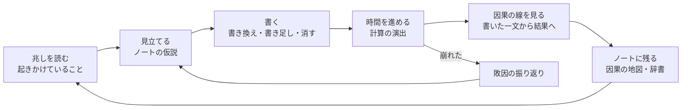

# テーマ・ゲーム性の分析

Sep 25, 2026 · @109mei

**要点**

- **題は『ラプラスの庭』を推す。** 決定論で動く世界と題が一致する。英字のロゴは WORLD.txt を残す（1章）
- **庭は絵と題だけの比喩にし、操作とタブは普通の言葉にする。** 書き換える・書き足す・消す、タブは世界・法則・ノート（2章）
- **3種類の操作を組み合わせないと解けないよう、ステージごとに原因の型と罠を持たせる**（4章）
- **書き方で読まれ方が変わる**：性質・制度・条件つき。国家の行などと組み合わさる（5章）
- **現実の知識で先が読める作りにして、学びを攻略にする**。数字には年と出典を付ける（6章）
- **学問で知られた振る舞いを、世界の中の仕組みに入れる**：物理・工学（遅れ、転換点の兆し、カオス）、心理学（慣れ、損の重さ、信頼、買いだめ、考え方の広がり）、社会の学問（経済・人口・感染・生態・政治）（7章）。画面と遊びは、片手の親指・覚えきれる量・遊ぶ人の心理に合わせる（8章）
- **絵は写実寄りにし、何がどこにあるか一目でわかる形にする**。色は意味にだけ使う（11章）
- **遊んでいる間は乱数を使わない**（ラプラスの決まり）。同じ世界番号と同じ書き換えなら、最後まで同じ世界になる。予測しにくさはカオスで作る（7章）
- **開いていく順番を作り込む**：1回のプレイで新しく覚える考えは1つ。体験してから、名前と画面が開く（13章）
- **演出に PixiJS（WebGL）を使う**。無料で、あとから読み込み、今の読み込みの決まりも守る（11章）
- **見やすさ：** 一目で追うのは寿命と4つの柱の5つだけ。動くのは何か起きたときだけ。絵文字や字の記号は使わず、線のアイコンに言葉を添える。図は同じ物差しの上の位置で比べる。「何か起きるまで」ボタンはやめた。明るい画面も用意し、最初は端末の設定に合わせる（12章）。
- **やりこみとセーブ：** 同じ世界を少ない手で解く腕前と、結末や決まりを見つける発見の2本にする（世界ごとの3つの印・世界番号の挑戦・図鑑・改稿者の試練）。セーブには、ホーム画面への追加の案内・ファイルでの書き出し・棋譜を足す（17・18章）。

## 1. 題「ラプラスの庭」の評価

**仕組みと題が一致しているので、推す。** ラプラスの悪魔は「すべての物の位置と運動を知る知性なら、未来を完全に予測できる」という考え。このゲームのルール本体は、同じ種・同じ書き換えなら必ず同じ世界になる決定論で、題がそのまま仕組みの説明になる。

**矛盾の解き方：** 悪魔は未来を知っているが、プレイヤーには結果を見せない。そこで役を分ける。**世界（悪魔）が計算し、プレイヤーは庭師として法則を書く。** 「未来は決まっている。だが、法則は書き換えられる」。時間を進めるのは、悪魔が計算する瞬間になる（11章の演出）。

良い点：

- 決定論の仕組みと一致する（「同じ世界でもう一度」も題に合う）
- 「庭」の絵で、書き足し・書き換え・消す・空き地・使える文字数を一つの比喩として見せられる（2章。操作の名前は普通の言葉）
- 黒と銀の写本・ゴシックの見た目に合う
- 日本語で検索したかぎり、同じ題の作品は見つからなかった

気をつける点：

- **英語の「Laplace's Garden」は、The Outer Worlds 2（2025年）の中の拠点の名前。** 英字の題には使わず、WORLD.txt を残す
- 日本語の「ラプラス」はポケモンの名前でもある（宮城県の「ラプラス公園 in せんだい」など）。検索で埋もれやすいので、副題で言葉を足す
- 近い名前の作品がある：ゲーム『ラプラスの魔』（1987年、2025年に Nintendo Switch で配信）、小説『ラプラスの魔女』（2015年、2018年に映画化）。「庭」で区別はつく
- 「ラプラスの悪魔」を知らない人には意味が伝わらない。タイトル画面の一文で補う

**提案：** 題『ラプラスの庭』、副題「世界は、文章でできている。」、英字のロゴは「WORLD.txt」（庭の設計図の名前として残す）。タイトル画面の一文は「未来は、決まっている。法則を、書き換えなければ。」。

## 2. 庭の比喩と、画面の言葉

**庭は、絵と題で仕組みを伝える比喩に使い、画面で押す言葉は普通の言葉にする。** 庭仕事の比喩は、空き地に雑草が生えるように、説明を読まなくても仕組みが伝わる。一方で「剪る」「接ぎ木」「手帖」は、読めない・意味がわからない人が多く、押す前に止まってしまう。WORLD.txt の文章そのものは現実の地球の話のままにする（舞台は変えない）。

| 仕組み | 画面の言葉（ボタン・タブ・見出し） | 絵での見せ方（比喩） | 直観で伝わること |
| --- | --- | --- | --- |
| 書き足す | 行を書き足す | 種をまく | 新しいものを入れる。効き始めるまで時間がかかる |
| 書き換える | 書き換える | 接ぎ木 | 今あるものの性質を変える |
| 消す | この行を消す | 抜く | 場所が空く。空いた土には雑草が生える |
| 空白 | 消した行（あと◯年で別の文が入る） | 空き地・雑草 | 放っておくと、世界がいちばん起こりやすいもので埋める |
| 世界容量 | 使える文字数 | 庭の広さ | 全部は書けない。年々減る |
| 書換の力 | 書き換えの残り | 季節ごとの手入れ | 入れられる手には限りがある |
| 副作用 | 想定外の変化 | 根が隣へ伸びる | 書いたものが、離れた場所に効く |
| 世界の適応 | 効きが落ちた | 害虫が慣れる・土がやせる | 同じ手は効きが落ちる |
| 原因の型 | 見立て（ノートの仮説） | 土の性質 | まず土を見立ててから手を打つ |
| 観測記録 | ノート（因果の地図・世界の辞書） | 庭の図鑑 | 見つけたものがたまっていく |
| 筆の位で閉じた行 | ロック（◯回クリアで開く） | 石の蓋 | 今はまだ触れない |
| 結末 | 世界の名前 | 30年後の庭の姿 | 人に見せたくなる |

**削除の問題が比喩だけで伝わる。** 「抜いたら雑草が生える」は誰でも知っているので、消すだけでは勝てない理由を説明しなくてよい（改善案の3章「空白」）。

**画面の言葉の決まり**

- 押すもの・タブ・数の名前は、常用漢字と普通の言葉で書く。比喩は絵と題に任せる
- 使わない言葉：剪る（常用漢字の外で読めない人が多い）→ 消す／接ぎ木する → 書き換える／種をまく → 書き足す／手帖（正しいが古い書き方。今は「手帳」が普通）→ ノート／庭（タブ名だと何の画面かわからない）→ 世界／封 → ロック／手入れの回数 → 書き換えの残り／庭の広さ → 使える文字数／重さ → 効き目
- 用語表を1つ作り、画面の言葉はそこからだけ取る（同じものを画面ごとに違う名前で呼ばない）
- 試作の10画面は、この決まりで作り直した

### 遊びの流れ（コアループ）

**「兆しを読む → 見立てる → 書く → 計算を見る → 因果の線を見る → ノートに残る」を1年ごとに回す。** 負けたら敗因の振り返りから見立てに戻る。

## 3. ゲーム性の分解

**面白さの芯「俺天才 → そうなるの！？」には、(1) 自信のある仮説、(2) 目に見える驚き、(3) 納得できる原因の3つが要る。** 今は (2) は出ているが、(1) は読み取りの不確かさで、(3) は因果の途中が見えないことで弱まっている。さらに、**消す判断に迷いがなく、負けても理由が残らない**。

### わかりやすさの4つの問い

| 問い | 今 | 止まっている理由 | 直し方 |
| --- | --- | --- | --- |
| 何ができるか（操作） | 行をタップして自由に書く | 世界がどの言葉を読めるかが見えず、書き足しの52%が意味なし | 書いている最中に「世界が読める言葉」に下線（10章） |
| 何が起きたか（結果） | 結果シートに状態語の変化が十数行 | 毎年ほぼ同じ形の一覧で、目が滑る | 大きな変化は3つまで、残りは世界の絵で見せる |
| なぜ起きたか（因果） | 「← 書いた一文」の文字 | 連鎖の途中が見えず、大崩れの年には付かない | 因果の連鎖を動きで見せる（11章） |
| 次に何をすべきか（兆し） | 14項目・終わりの線4本・タグ・ニュース | 情報が多く、どれが兆しか分からない | 4つの柱と「起きかけていること」に絞る |

### 判断の質：消す判断に迷いがない

**48行のうち、消したときに得にも損にもなる行は7行だけ。** 16行は消すと得しかなく、23行は損しかない。面白い判断は「どちらも欲しいもののうち、どちらを手放すか」なのに、今は消す判断の8割に迷いようがない。

| 消したときの効果 | 行の数 | 例 |
| --- | --- | --- |
| どのステージでも得しかない | **16** | 争いは戦争になりうる・国家は領土を持つ・兵器は人を傷つける・病原体は空気にのって広がる |
| どのステージでも損しかない | **23** | 太陽は地球を照らす・雨となって降る・植物は育つ・電気は導線を伝わる・お金は価値を交換する |
| ステージで得にも損にもなる | **7** | 石油には限りがある・人間は子を産む・人は幸せを求める |
| ほぼ変わらない | 2 | 人間は酸素を吸って生きる・海は二酸化炭素を吸い込む |

測り方：1行だけを最初の年に消し、何もしない世界より何年長く（短く）続いたか。5ステージ（食料・感染症・気候・大戦・資源）、種12個。1年を超えて長くなれば得、短くなれば損とした。

**直し方：どの行にも、消したときの得と損を1つずつ持たせる。** 例：犯罪を消すと安定は上がるが、決まりを破る発明も消えて科学が止まる。太陽を少し弱めると暑さは和らぐが、作物も育ちにくくなる。改善案の6章「何を残すか」の軸と、改善案の「空白」とつながる。

### 時間の密度：静かな年と重すぎる年の差が大きい

試し遊びの30年では、**ほぼ何も起きない年（結果の文が30字台以下）が4年、300字を超える年が5年**あった。1ステージで30〜50回押すので、静かな年は退屈に、重い年は読み飛ばしにつながる。

- 静かな年は、計算の演出を約0.4秒に縮め、結果の画面を出さずに世界へ戻る。まとめて飛ばすボタンは置かない（兆しを1年ずつ読むのが遊びの芯なので。12章）
- 重い年は「大きな変化3つ＋因果の線」に絞り、残りは押すと開く

### 難しさの曲線：新しい仕組みは1ステージに1つ

**一度に覚えることを1つに絞ると、超難しくしても理不尽にならない。** 今の開く順（はじめから3つ → 1つ救う → 2つ → 3つ）に合わせて、新しい考えを1つずつ入れる（ゲームの仕組みと世界の決まりを、同じ考えでそろえる。全体の順番は13章）。

| 開く時期 | ステージ | 新しく入る仕組み | 原因の型 |
| --- | --- | --- | --- |
| はじめ | 序章「ひと区画の庭」 | 3つの操作・空白 | なし |
| はじめ | 食料危機 | 原因の型・世界の読み | 初回は1つ、2回目から3つ |
| はじめ | 感染症 | 世界の適応 | 3つ |
| はじめ | 気候危機 | 使える文字数が減る | 3つ |
| 1つ救う | 世界大戦 | 支えている行 | 3つ |
| 1つ救う | 資源枯渇 | 危機の重ね | 3つ |
| 2つ救う | くり返す十年 | 同じ10年を見届ける | 決まった連鎖 |
| 3つ救う | 極小世界 | 三つ巴（3つの柱のからみ） | 縮む速さ |

はじめから選べる3つのうち、最初に選んだステージだけは型1つから始める。

### 負けから学べるか：理由が残らない

**超難しいゲームは、負けたときに「どこで何をすればよかったか」がわからないと続かない。** 今のリザルトは滅び方の名前と歩みを出すが、崩れた原因の連鎖と、手を打てた年は出ない。

- **敗因の振り返り**を足す：崩れた柱から原因を逆にたどった連鎖を見せる（書いた一文は青いインク、世界の出来事は珊瑚）。つながりは core が付けている原因から作り、新しく推測しない
- **分かれ道の年**に印を付ける：その柱の兆しが最初に出た年
- そこから「同じ世界でもう一度」に進める

## 4. ステージごとの設計

**どのステージにも「原因の型」「ひらめき」「罠」を1組ずつ持たせ、罠は今の実測（SPEC 5章）から選ぶ。** 罠は「悪いものを消す」「一文で片づける」を選んだ人が落ちる所で、ひらめきは3種類の操作を組み合わせたときだけ届く答え。

| ステージ | 原因の型（案） | ひらめき（3種類で届く答え） | 罠（実測） |
| --- | --- | --- | --- |
| 食料危機 | 水が足りない／届かない／病害 | 消して場所を空け、蓄えの仕組みを書き足し、空白を自分の文で埋める | 食事を減らすと、職の喪失と作物病原体が必ず来る（数日に一度だけでは 33%） |
| 感染症 | 空気で広がる／動物から来る／変わり続ける | 広がり方を書き換え、支え合いを書き足し、体の側の反動を埋める | 一手だけでは 17% 以下（触れたときだけ 3%・変異しない 17%・生まれつきの免疫 0%） |
| 気候危機 | 燃やしすぎ／吸う力が落ちた／転換点が近い | 冷やすのではなく、燃やす理由を書き換える | 温室効果を消すと氷期で滅びる（すべての種で失敗、平均18年） |
| 世界大戦 | 奪い合い／国境／恐れの連鎖 | 争いの原因（領土・分配）を書き換え、話し合いを書き足す | 戦争を消すだけでは制裁とテロの冷たい戦争になり 0%（平均28年で崩壊） |
| 資源枯渇 | 尽きる／届かない／使いすぎ | 限りは残したまま、置き換えと使い方を組み立てる | 石油の限りを消すと、値崩れで産油国が傾く（すべての種で起きる） |
| 極小世界 | 水／緊張／使える文字数 | 害の少ない行を消して言い換え、そのうえで直す | 言い換えだけ 0%（3年で容量の限界）、消すだけ 0%（平均24年） |
| くり返す十年 | 巻き戻しの根がどこにあるか | 根を断ち、抜けたあとの20年にも手を打つ | 根を断つだけなら10年目に抜けられるが、その後に手を打たないと滅びる |

### 例：食料危機「水が足りない型」

1〜3年目の兆しは、**雨の少ない年が続く・給水制限が始まった・川が細っている**の3つ。そろえば、ノートの仮説が確定する（試作のノート画面）。

1. **消す**：「食べ物は時間がたつと腐る。」を消して場所を空ける（消し跡が残るので、13字の半分の6字だけ空く）。空いた行は3〜5年で世界が埋めに来る
2. **書き足す**：48行にない「ため池」や「蔵」を入れる。効き始めは2年ほど先
3. **書き換える**：「植物は少しの水で育つ。」で干ばつの年を持ちこたえる
4. **空白を埋める**：世界が埋める前に、空いた行を自分の文で埋める（「食べ物は涼しい蔵では腐りにくい」など）

今の作戦で近いものは「数日に一度＋蔵＋少しの水＋7年目に一年中実る」で 70%。

**同じ手は、別の型では効かない。** 「届かない型」なら、ため池ではなく分け合う仕組みが要る（5章の性質・制度）。「病害型」なら、害虫を消す手が効く（今の「数日に一度＋蔵＋害虫を消す」80%）。

## 5. 書き方の読み分け：性質・制度・条件つき

**同じ願いでも、書き方で「誰が、どう守るか」が変わるようにする。** 今は「人は食べ物を分かち合う」と「人は食べ物を分け合わなければならない」が同じ言い回し（share）に読まれ、効き方も副作用も同じになる。書き方を読み分けると、言葉の選び方そのものが判断になり、国家やお金の行との組み合わせが生まれる。

| 読まれ方 | 書き方の例 | 効き方 | 副作用・弱点 | 組み合わせ |
| --- | --- | --- | --- | --- |
| **性質**（心から） | 人は食べ物を分かち合う／人は争いを好まない | 人の心と習慣そのものが変わる。効き始めは遅い（2〜3年） | 行きすぎると「譲り合いの停滞」（今ある副作用。産業−8%・幸福−3） | 国家を消しても残る |
| **制度**（決まりで守らせる） | 国は食べ物を配る／人は食べ物を分けなければならない | 決まりとして守らせる。効き始めが速く（翌年）、効き目も確か | **国家の行がないと効かない。** 闇市・働く意欲の低下・不満が育つ | 国家・お金・犯罪の行とつながる |
| **条件つき** | 人は余った食べ物を分かち合う／飢えたときだけ分ける | 条件を満たした年だけ効く | 効き目は小さく、条件が起きなければ何もしない | 腐る・蔵の行と組むと強い |

**「国家を消す」と「配給を書く」がぶつかる。** 戦争を減らすために国家を消した世界では、制度として書いた分配は空回りし、性質として書いた分配だけが残る。反対に、性質は効き始めが遅いので、干ばつが目の前なら制度の方が間に合う。どちらを選ぶかは、その世界の兆しと残りの年数で決まる。

**制度は性質を締め出す。** 同じ分け合いを制度と性質の両方で書くと、性質の広がりが下がり、制度を消しても元に戻らない（7章の心理学。罰金で遅刻が増えた保育園の実験）。性質だけでは、ただ乗りで年とともに薄れる。**性質を先に書き、広がってから軽い決まりを添える**のが、長持ちする組み方になる。

画面：書く画面の「世界の読み」に**読まれ方**を出す（性質・制度・条件つきのうち1つが光り、1行の説明がつく）。結果の向きや大きさは見せず、どう読まれたかだけを見せる（10章の方針どおり）。書き足した行と結末の一覧にも同じ札を付ける（試作の「法則」「結末」画面）。

作り方（案）：

- phrases.json の言い回しに `mode`（nature・rule・conditional）を足す。まず share と、戦争・犯罪・平等など人の振る舞いの言い回しから
- 語尾で判定する：「〜なければならない・〜ねばならない・〜させる・〜を配る・〜と決める・法律で」→ 制度、「〜とき・〜なら・〜だけ・余った」→ 条件つき、それ以外 → 性質
- interpret.ts にはすでに「なければならない」を否定と読まない決まり（`NOT_NEG`）と、「〜なしでは」の読み（`NEEDS_G`）がある。同じ場所に足せる
- 3つの読まれ方ごとの効き・遅れ・副作用は balance.json に置き、`npm run sim` で3つとも使い道があるか測る

現実では（「なぜ？」にそのまま使える）：

- **制度の例**：イギリスは1940年1月に食料の配給を始め、1954年にすべて終えた。戦時中は闇市が生まれ、1941年3月までに2,300人が不正で罰せられた（帝国戦争博物館）
- **自分たちの決まりの例**：オストロムは、共有の牧草地や漁場や森を、国でも市場でもなく使う人たち自身の決まりで長く守ってきた例を調べ、2009年にノーベル経済学賞を受けた（受賞理由は「経済の統治、特に共有資源の分析」）

## 6. 現実の知識で先を読む（現実のtips）

**現実を知っているほど先が読める作りにして、学びをそのまま攻略にする。** データにはもう、48行すべてに「現実では」の一文があり、出来事205件のうち146件に「なぜ？」がある。足りないのは、出す場所と、攻略とのつながり。

| 場面 | 出すもの | 長さ |
| --- | --- | --- |
| 書く画面 | 選んだ行の「現実では」（今ある） | 2行まで |
| 計算中の数秒 | 今の世界に近い現実の一文 | 2行＋出典。タップで飛ばせる |
| 因果の連鎖 | 想定外の変化の「なぜ？」（今ある） | 2行まで |
| 結末 | 選んだ願いに近い現実の数字1つ | 2行＋出典 |
| ノートの辞書 | 言葉ごとの現実の一文と出典 | 開いたときだけ |

### 学びが攻略になる例

| 現実の知識 | ゲームで読めること |
| --- | --- |
| 世界の淡水利用の約7割は農業が使う（今ある一文） | 水の行を触ると、糧が大きく動く |
| 世界の働き手の約4分の1は農業で働く（2023年に約26%。ILOの推計、世界銀行） | 食べる回数を減らすと仕事が減り、社会が揺れる |
| 収穫から売り場の前までに食べ物の約13%が失われ（FAO）、店・外食・家庭で約19%が捨てられる（UNEP、2022年） | 腐る・蔵・運ぶの行が、糧に大きく効く |
| 2024年、世界の約8.2%（約6.73億人）が飢えていた（FAOほか、2025年） | 量だけでなく届け方が要る（届かない型） |
| 天気は、計算を尽くしても約2週間先までしか当てられない（Zhang ほか、2019年） | 小さな書き換えほど、遠い年で大きくずれる行がある（7章） |

**決まり**

- 数字には年と出典を付ける。画面では短く、ノートで全文
- 丸めた数字に「約」を付ける。幅のあるものは幅で出す
- 「現実では」の枠には現実だけを書き、ゲームの中の出来事と混ぜない
- 答えそのものは書かない。「淡水の約7割は農業」は書くが、「だから水の行を書き換えよ」は書かない
- 数字は年に1度点検する（プロンプト P11）

## 7. 学問を借りたシミュレーション（物理・工学・心理・社会）

**世界の中の物と人を、学問で知られている振る舞いで動かす。** 物理と工学からは遅れ・行きすぎ・転換点・カオスを、心理学からは世界の人々の心（慣れ・損の重さ・信頼・不安・考え方の広がり）を、社会の学問からは経済・人口・感染・生態・政治の仕組みを借りる。ラプラスの悪魔の題とも合う。今のルールは乱数の種を除けば決まった式で動き、副作用も毎年決まった量で育つ。足すのは乱数ではなく、式の形と、その兆しの見せ方。

**学問の仕組みは、すべて入れる（決定）。** ただし一度には教えない。1ステージに1つの考えずつ紹介し、紹介する前は弱く動かす（13章「開いていく順番」）。どれも乱数を使わない（この章の「乱数を使わない世界」）。

### 物理と工学から

| 分野 | 現実で知られていること | ゲームに入れる形 | 画面での見せ方 |
| --- | --- | --- | --- |
| 力学（慣性） | 重いものは急に動かず、急に止まらない | 柱ごとに重さを持たせる。人口と大地は重く、社会と物価は軽い。重い柱ほど書き換えの効きが遅く、止まりにくい | 柱の針が、重い柱ほどゆっくり動く（動きの速さで重さを伝える） |
| 制御工学（遅れと行きすぎ） | 遅れのある系を目の前の結果だけで直そうとすると、行きすぎて揺れる。ビールゲームでは、注文してまだ届いていない分を人が見落とし、在庫が大きく振れる（Sterman 1989） | 書き換えの効きに、はっきりした遅れを持たせる。効く前に慌てて書き直すと、行きすぎる | 「効き始めまであと◯年」を出す。届く途中の効き目を、線の中を進む光で見せる |
| システムダイナミクス（貯めと流れ・ループ） | 『成長の限界』（1972年）の World3 は、人口・食料・資源・汚染を、貯め（ストック）と流れ（フロー）とループで表した | 4つの柱を貯め、出来事を流れにする。強め合うループと打ち消し合うループを、因果の地図に出す | ノートの因果の地図で、ループに「強め合う」「打ち消す」の印を付ける |
| 転換点と臨界減速 | 系が転換点に近づくと、揺れからの戻りが遅くなり、ばらつきが増える。生態系・気候・市場に共通する兆し（Scheffer ほか 2009） | 柱が寿命の線に近づくと、小さな揺れからの戻りが遅くなる | 「起きかけていること」に**戻りの遅さ**を兆しとして出す（針の揺れがゆっくりになる）。現実に使われている指標なので、学べて攻略にもなる |
| カオス（初期値への敏感さ） | 小さな違いが大きく育つ。天気は約2週間先までしか当てられない（Lorenz 1963、Zhang ほか 2019） | 決定論のまま、1字違う書き換えが遠い年で大きくずれる行を少しだけ作る。予測できる行とできない行を混ぜる | 「同じ世界でもう一度」で、前回と今回の人口の線を重ね、どの年から分かれたかを見せる |
| 天体力学（三体問題） | 2つの天体の動きは式で解けるが、3つになると一般には式で解けず、先は計算を重ねないとわからない | 2つの柱のつながりは読みやすく、3つがからむと急に読みにくくなるようにする。難しいステージほど三つ巴を増やす | 因果の地図で、3つがからむところに「読みにくい」印 |
| 信頼性工学（冗長性・単一故障点） | 大事なものを1本に頼ると、そこが切れたとき全体が止まる。予備があると強い | 糧・水・エネルギーが何本の行に支えられているかを数え、1本だけのところを弱点にする | 柱を押すと「予備の数」（その柱を支えている行の数）が出る。1本だけなら珊瑚の印 |
| 保存則（物理） | エネルギーや物は、何もないところから生まれない | 「〜が無限にある」と書いても、別のどこかが減る（置き換えとして読む） | 世界の読みで「どこから来るか」を1行で出す |

### 心理学から：世界の人々の心

**世界の人々は、計算機ではなく人間として動く。** 今のモデルでは、幸福・安定・緊張・心は「今の状態から決まる目標」へ毎年一定の割合で近づくだけで、過去との比べ方・損と得の重さの違い・人から人への広がりがない。そのため、ゆっくり悪くなっても急に悪くなっても同じ反応になり、書き足した考え方も一律に効く。

| 心理学で知られていること | 出典 | 世界の中の仕組み | プレイヤーが読むこと |
| --- | --- | --- | --- |
| **慣れ**：人は今の水準そのものより、慣れた水準との差で満足や不満を感じる | 快楽順応（Frederick & Loewenstein 1999）、基準のずれ（Pauly 1995） | 幸福と不満を「今の暮らし − 慣れた基準」で決める。基準は毎年少しずつ今に近づく | ゆっくり悪くなる世界では声が上がらない。**不満の小ささが危険の兆しになる** |
| **損は得より重い** | プロスペクト理論（Kahneman & Tversky 1979）。重さは研究によって約1.3〜2倍と幅がある | 基準より下がった分は、上がった分より重く幸福と安定を下げる | 何かを取り上げる書き換えは、同じだけ与える書き換えより強く揺れる |
| **信頼は、築くのは遅く、壊れるのは速い** | 信頼の非対称（Slovic 1993） | 新しい貯め「信頼」を足す。上がるのは年に少し、下がるのは一度に大きく | 制度の効き目と、買いだめの起きにくさを決める。**一度の不公平が長く響く** |
| **予言の自己成就**：足りなくなると信じると、買いだめで本当に足りなくなる | Merton 1948。1973年11月1日、大阪の千里ニュータウンのスーパーでトイレットペーパー1400パックが約1時間で売り切れ、買いだめが広がった | 新しい貯め「先行きの不安」を足す。不安が線を超え、信頼が低いと買いだめが起き、物の流れが細る | 足りない知らせそのものが危機を呼ぶ。量を増やすより、不安を下げる手（蔵・分け合い）が効く |
| **考え方は人から人へ広がり、ある割合を超えると一気に入れ替わる** | 閾値モデル（Granovetter 1978）。変えようとする人が25%を超えると集団の決まりが入れ替わった実験（Centola ほか 2018） | 性質として書いた文は、広がった割合のぶんだけ効く（S字）。信頼が低いと広がりが止まる | 性質は遅いが、線を超えると一気に効く。**いつ書くか**が判断になる |
| **決まりやお金が、自分からの気持ちを締め出す** | 保育園で迎えの遅刻に罰金を付けると遅刻が増え、罰金をやめても減らなかった（Gneezy & Rustichini 2000。イスラエルのハイファの10園） | 同じことを制度と性質の両方で書くと、性質の広がりが下がる。制度を消しても元に戻らない | 性質と制度は足し算にならない。**書く順番**が効く |
| **ただ乗りは、止める仕組みがないと広がる** | 公共財の実験。罰を与えられると協力がほぼ保たれた（Fehr & Gächter 2000） | 性質の分け合いは、止める仕組みがないと年とともに薄れる | 性質だけでも、制度だけでも足りない。軽い決まりとの組み方を探す |
| **乏しさは考える余裕を奪う** | 同じ農家でも、収穫前（お金に困る時期）は収穫後より考える力が落ちた（Mani ほか 2013） | 糧や物が足りない年は、科学と先の備えが鈍る（今ある「心」の効き目を強める） | 足りない世界ほど立て直しが遅い。**早めの手**が安い |
| **危機の直後は助け合い、長引くと疲れる** | 災害のときパニックはまれで助け合いが多い（Quarantelli ほかの災害研究）、パンデミック疲れ（WHO 欧州事務局 2020） | 大きな出来事の直後は助け合いが一時上がり、同じ制度が何年も続くと守られにくくなる | 制度は長く頼るほど効きが落ちる。世界の適応とつながる |

### 社会の学問から：経済・人口・感染・生態・政治

| 分野 | 知られていること | 世界の中の仕組み | プレイヤーが読むこと |
| --- | --- | --- | --- |
| 経済学 | 豊かになるほど、同じ増え方で得られる満足は小さくなる。暮らしの評価は収入のほぼ対数で上がる（Kahneman & Deaton 2010） | 幸福を、糧や物の量の対数で計算する | 足りない世界での少しの増加は大きく効き、豊かな世界では効きにくい |
| 経済学 | 効率が上がると、かえって使う量が増えることがある（ジェヴォンズの逆説） | 省エネや少ない水で育つ書き換えは、使う量の増加を呼ぶ（改善案の「世界が適応する」） | 効率だけの書き換えは、あとで効きが落ちる |
| 人口学 | 教育と暮らしが良くなると、生まれる子の数が減る（人口転換） | 出生率を、教育・医療・暮らしの向上で下げる | 人口の圧力は、食料の行より教育の行で緩むことがある |
| 疫学 | 感染が広がると人は接触を減らし、落ち着くと戻す。流行は波になる（Funk ほか 2010） | 今の感染の式（R0 × 変異 × 免疫 × 医療）に、人の用心の貯めを足す | 一度収まっても、用心が緩むと次の波が来る |
| 生態学 | 増えすぎた群れは、厳しい年に大きく崩れる。セント・マシュー島のトナカイは1944年の29頭が1963年に約6,000頭になり、3年後に42頭まで減った（最後は記録的な大寒波が引き金） | 限りを超えた状態が続くと、ふだんなら耐えられる出来事で崩れる | 限りを超えた豊かさは、次の一撃に弱い |
| 政治学 | 良くなり続けたあとで急に悪くなると、不満が爆発しやすい（J字曲線：Davies 1962）。世界の食料価格の高騰は、北アフリカ・中東の暴動と時期が重なった（Lagi ほか 2011） | 緊張を、今の水準ではなく「期待とのずれ」と「物価の上がる速さ」で決める | 上げてから落とす書き換えは危ない |
| 政治学 | 自国を守る備えが、相手には脅威に見える（安全保障のジレンマ：Jervis 1978） | 片方の防衛の行が、相手側の緊張を上げる | 守りを固める書き換えが、戦争を近づけることがある |
| 社会学 | 加わる人が増えるほど加わりやすくなり、暴動や抗議は一気に起きる（閾値モデル：Granovetter 1978） | 今は緊張が線を超えると確率で戦争が始まる。これを、人の閾値の分布から決まる「なだれ」に置き換え、条件で起こす | 緊張の平均でなく、**ばらつき**を見る。兆しで読める |

### 組み合わせで生まれる判断（例）

- **分かち合いは、性質で書いてから軽い決まりを添える**：先に制度を書くと性質が広がらない（締め出し）。性質だけでは、ただ乗りで薄れる。性質が25%に届いたあとに軽い決まりを添えると長持ちする
- **ゆっくり悪くなる世界を見抜く**：慣れで不満が上がらないので、兆しは「不満が小さすぎる」ことになる。数字の下がり方と声の小ささを比べて読む
- **足りない知らせで買いだめを起こさない**：先行きの不安が線に近いときは、量を増やす書き換えより、信頼と蔵の書き換えが効く
- **急に取り上げない**：損は重く、J字の爆発を呼ぶ。同じ量を減らすなら、何年かに分ける

画面では、4つの柱を押すと中身が開き、命の柱の中に**人々の心**（信頼・先行きの不安・慣れ・考え方の広がり）を出す（試作の「9 柱の中身」）。数字より、上がり方・下がり方と線で見せる。

### 乱数を使わない世界（ラプラスの決まり）

**遊んでいる間は、さいころを一度も振らない。** ラプラスの悪魔は「今のすべてを知る知性なら、未来を計算できる」という考えなので、この世界もそうする。今は種つきの疑似乱数（mulberry32）で、出来事の確率・戦争の始まり・世界異常・危機の選び方を決めている。同じ種なら同じ世界になるが、遊ぶ人から見れば運で、同じ一手でも食料危機は30回中10回しかクリアできない（改善案の1章）。

| 今、乱数を使っているところ | 決まった式への置き換え |
| --- | --- |
| 出来事205件のうち19件の、起きる確率（1%〜50%） | **起きる力をためる**：条件がそろっている年ごとに確率の分だけためて、1を超えた年に必ず起きる。長い目で見た回数は今と同じ。ためた量は兆しとして見せる |
| 戦争の始まり（緊張が線を超えると確率で始まる） | 人々の閾値の分布から決まるなだれ（社会学の表）。直前の年に兆しを出す |
| 世界異常（起きるかどうかと、どれが起きるか） | 整合性が決まった線を下回った年に起き、いちばん無理のある行に関係するものが起きる |
| 存在消失で消える行 | 整合性をいちばん下げている行が消える |
| 無限の世界の危機（どれが来るかと、次までの年数） | その世界でいちばん弱っている柱の危機が来る。間隔は、年とともに縮む決まった式にする |
| 世界ごとの違い（種。今日の世界は日付から作る） | **世界番号を初期条件にする**：原因の型・はじめの数値の少しの違い・危機の順番を、世界番号から決まった式で作る。遊んでいる間は使わない |

- **予測しにくさは、乱数ではなくカオスで作る**（物理と工学の表）。決まった式でも、小さな違いは大きく育つ
- 同じ世界番号と同じ書き換えなら、誰が遊んでも1年目から最後まで同じ世界になる。「同じ世界でもう一度」と「世界番号で共有」がそのまま成り立ち、負けた理由を運のせいにできなくなる
- 演出も同じ：インクの散り方や粒子の動きは、書いた文から決まる。**同じ文は、いつも同じ散り方をする**。効果音のゆらぎ（今は Math.random）も、決まった式に置き換える
- 試しの測り方も変わる：今は「種30個」で回しているが、これからは「世界番号30個（初期条件30通り）」で回す。同じ世界番号で2回回して、結果が完全に一致することもテストで守る

**作るときの決まり**

- **乱数を使わない**。足さないだけでなく、今ある乱数もなくす（上の「乱数を使わない世界」）
- 新しい考えは1回のプレイで1つまで（13章の開いていく順番）
- 転換点は必ず兆しを先に見せる。見えない転換点で負けさせない
- 科学の名前は画面に出さない。「臨界減速」ではなく「戻りが遅い」、「三体問題」ではなく「読みにくい」と書き、名前はノートの「現実では」で教える
- 心理の数字は幅で使う。損の重さのように研究で値が割れるものは、1つの研究の値に頼らず、幅の中でバランスを取る
- 世界の人々を愚かに描かない。災害研究のとおり、多くの人は助け合う。崩れるのは仕組みの結果として描き、人のせいにしない

## 8. 人間工学と心理学から見た画面と遊び

**片手の親指で、迷わず、覚えきれる量だけを押せる画面にし、遊ぶ人の心の動きに合わせて難しさと驚きを置く。** 試作の10画面はこの章の決まりで作った。

| 知られていること | 数字・出典 | この画面での決まり |
| --- | --- | --- |
| 片手で持って親指で触る人が多い | 画面に触れていた人の49%が片手、36%が片手で持ってもう一方の指、15%が両手（Hoober 2013、1,333件の観察） | よく押す「1年」「書き換える」は画面の下半分に。メニューなど、まれな操作は上 |
| 的は大きく近いほど、速く正確に押せる（フィッツの法則） | Fitts 1954 | 押す的は44×44pt以上（Apple のガイド）。主な操作は幅いっぱい、高さ52px |
| 選択肢が多いほど、選ぶのに時間がかかる（ヒックの法則） | Hick 1952 | 一度に出す選択肢を絞る。柱は4つ、起きかけていることは3件まで |
| 一度に頭に置けるのは4つ前後 | Cowan 2001 | 14項目を常に出さず、柱4つにまとめる。大きな変化は3つまで |
| 文字と背景の明るさの差 | WCAG 2 では本文4.5:1以上 | 薄い文字 #8b8f97 でも黒地に対して約6.3:1。情景の名前は10px以上で、背景を敷く |
| 動きで気分が悪くなる人がいる | OS の「視差効果を減らす」設定 | `prefers-reduced-motion` で動きを止める（試作に入れ済み） |
| 色だけでは伝わらない人がいる | 色覚の多様性 | 色に加えて形（実線・点線・破線・斜線）で意味を二重に伝える |
| 読めない字は、意味の前に止まる | 常用漢字表（2010年） | 操作とタブは常用漢字と普通の言葉で。比喩の言葉は絵に（2章） |

### 遊ぶ人の心理

| 心理学で知られていること | 出典 | このゲームでの使い方 |
| --- | --- | --- |
| 難しさと腕前が釣り合うと、時間を忘れて没頭する（フロー） | Csikszentmihalyi 1990 | 1ステージに新しい仕組みは1つ（3章）。負けたら同じ世界ですぐ試せる |
| 自分で選べる・うまくなれる・人とつながれる、の3つがそろうと続けたくなる | 自己決定理論をゲームに当てた研究（Ryan, Rigby & Przybylski 2006） | 自由に書ける（選べる）、仮説が当たる（うまくなる）、世界番号で共有する（つながる） |
| 知っていることと知りたいことの間に空白があると、知りたくなる | 情報の空白（Loewenstein 1994） | 因果の地図の「？」と、起きかけていることの残り年数 |
| 体験は、いちばん強い瞬間と終わり方で記憶される | ピーク・エンドの法則（Kahneman ほか 1993） | 想定外の瞬間の演出と、結末の10秒の早回しに力を入れる |
| 少し苦労して予想した方が、よく身につく | 望ましい困難（Bjork 1994） | 結果を見る前に、ノートに仮説を書く。答えは先に見せない |
| 結果を知ると「最初からわかっていた」と感じる | 後知恵バイアス（Fischhoff 1975） | 敗因の振り返りでは、その年に見えていた兆しだけを出す。あとから知った情報で責めない |
| 人は自分の考えに合う証拠を探しがち | 確証バイアス（Wason 1960） | 仮説に合わない兆しも、ノートに並べて見せる |
| 理由のわからない失敗が続くと、試すのをやめてしまう | 学習性無力感（Seligman ほか） | 負けたら必ず理由と、手を打てた年を出す |

## 9. 他のゲームとの比較

**ルールを書き換えるゲームの先例は多いが、「自由な文章」と「現実の因果」を両方持つ作品は少ない。** そこが独自性なので仕組みは守り、先例からは「見せ方」を借りる。

| 作品 | 似ている点 | 学べること | 取り入れ方 |
| --- | --- | --- | --- |
| Baba Is You（2019） | 文字のルールを動かすと、世界の決まりが変わる | ルールは少なく全部見えていて、変えた瞬間に世界が変わる。1つの面に1つのひらめき | **各ステージに「この世界ならではのひらめき」を1つ設計する** |
| Scribblenauts（2009） | 言葉を書くと、それが世界に現れる | 何でも書ける喜びは大きいが、強すぎる言葉で解けてしまう | 語彙の広さは残し、強い言葉ほど重く、反動を大きくする |
| Chants of Sennaar（2023） | 知らない言葉の意味を、観察して解く | 推測した意味が手帳で確定する快感 | **世界に通じた言葉を「世界の辞書」に集める。** 通じない言葉も「まだ知らない言葉」として残し、読み取りの穴を遊びに変える |
| Outer Wilds（2019） | 同じ時間をくり返し、知識だけが残る | 船のログが、手がかりのつながりを線で見せる | **観測記録を「因果の地図」にする。** くり返す十年と特に相性がよい |
| Return of the Obra Dinn（2018） | 手がかりから原因を推理する | 3つまとめて正解すると確定するので、当てずっぽうが効かない | 原因の型の見立てを「仮説」として書き留め、当たると確定する |
| Frostpunk（2018） | 「法の書」に法を書き足して社会を保つ | 大きな指標2本（希望と不満）で全体が読める。法の代償はあとから来る | **14項目を4つの柱にまとめる** |
| Plague Inc.（2012） | 世界規模の因果をシミュレーションする | 広がりが地図の色でひと目でわかり、ニュースの帯が兆しとヒントを兼ねる | 世界の絵を「読める地図」にする。ニュースを兆しの主役にする |
| Reigns（2016） | 一つの判断で複数の指標が動き、極端になると終わる | 選ぶ前に「どの指標が動くか」だけ点で見せ、向きは見せない | 書く前に「触れる柱」だけ光らせる案は、採らないと決めた（16章）。代わりに読まれ方を出す |
| Into the Breach（2018） | 先の脅威に備えて手を打つ | 敵が次に何をするかが全部見えるので、難しくても理不尽ではない | **「起きかけていること」を年数つきで見せる**（書き換えの結果は見せない） |
| Opus Magnum（2017） | 解き方が人それぞれ | 解いたあと、自分の解き方を他の人の分布と比べられる | リザルトに書き換え回数・字数・年数の分布（まずは自分の記録から） |
| Democracy（シリーズ） | 政策と社会の指標が因果でつながる | 因果の網そのものが画面になっている | 項目の詳細の「つながり」を網の図にする |
| Universal Paperclips（2017） | 文字だけの画面で世界が変わっていく | 最初は最小限で、進むほど画面が広がる | 筆の位に合わせて、画面の情報も段階的に開く |

年は最初の発売年。内容は、各作品のよく知られた仕組みの概要。

## 10. 画面に出すもの・減らすもの・出さないもの

**「世界が読める言葉」「起きかけていること」「因果の線」の3つを新しく出し、常に出している数字と一覧は減らす。** 書き換えの結果の予測は、これまでどおり出さない。

新しく出す：

- **世界が読める言葉**：書く画面で、世界が知っている言葉に下線、知らない言葉に点線。入力しながら変わる（結果の予測ではなく、言葉が通じるかだけ）
- **4つの柱と世界の寿命**：命（人類・健康・心）・糧（食料・水・エネルギー・物流）・社会（社会・世界情勢・産業・物価・科学）・大地（生態系・気候）で、今の14項目をそのまま分ける。終わりの線はいちばん近いものだけ1本
- **起きかけていること**：兆しのカードを最大3枚（「北の穀倉地帯で乾いた年が続いている・あと2年ほど」）。危機の知らせもここに並べる
- **因果の線**：時間を進めた年に、書いた一文から柱へ光の線が順に伸びる（11章）
- **空白の行**：消した行の跡に雑草のしるしと、世界が埋めに来るまでの年数
- **仮説の書き留め**：原因の型の見立てを書き留め、当たると確定
- **同じ世界でもう一度**・世界番号

減らす：

- 14項目の常時表示 → 柱を押すと開く
- 世界の終わりまでの4本 → 寿命1本（いちばん近い線だけ）
- 結果シートの状態語の羅列 → 大きいもの3つまで（残りは「ほかの変化」を押すと開く）
- タグの常時表示 → リザルトと歴史へ

出さない（方針どおり）：

- 書き換えの結果の予測（向き・大きさ）
- 内部の点数

決めたこと：書く前に「触れる柱」だけ光らせる案（Reigns 式）は採らない。結果の予測を見せない方針を守り、代わりに読まれ方（5章）を出す（16章）。

## 11. ラプラスの演出（動き・VFX・モーションブラー・モーショングラフィックス）

**動きとVFXは「因果が計算されていく様子」を見せるためだけに使う。** 飾りの動きを増やすと、兆しや因果の線が埋もれる。**モーションブラーは「時間が速く流れているとき」だけ**に使い、時間の感覚と結びつける。

**何もない間は、情景も数字も止まっている。** 動くのは、書いた・1年進めた・兆しが出た・崩れた・結末のときだけ。くわしい決まりは12章の「見やすさの点検」。

### 場面ごとの演出

| 場面 | モーション・VFX | 伝えること | 長さ |
| --- | --- | --- | --- |
| 書いた瞬間 | 文字がインクでにじみ、ほどけて粒子になり、種として庭の区画へ落ちる | 文が世界に入った | 約0.8秒 |
| **時間を進める（悪魔の計算）** | 止まった薄い数式の上で、年の数字が縦のモーションブラーで回り、庭が早回しで横に流れる（雲・人・影・船が横のモーションブラーと残像を引く）。動くのはこの2つだけ。静かな年は約0.4秒 | 世界が決まりどおり1年ぶん計算された | 約1.2秒 |
| **因果の連鎖** | 書いた一文から光の線が柱へ順に伸びる（直接 → 間接 → 想定外）。想定外は線が折れて思わぬ柱へ跳び、着いた所で小さな衝撃波 | 「そこに影響するのか！」 | 1つ約0.3秒、最大6つ |
| 大崩れ | 色が一瞬抜け、柱にひびが入る。低い音とごく小さな揺れ | 取り返しのつかない変化 | 約0.6秒 |
| 起きかけていること | 兆しが出た年に1回だけ、空に軌道の線が伸びる（隕石）、地平から陽炎が近づく（干ばつ・熱）、国境に火の粉（戦火）。そのあとは止まった絵で残す | 何年後に何が来るか | 出た年に1回（約1秒） |
| 空白 | 消した行の跡から雑草がじわじわ伸び、庭の空いた区画が荒れていく | 空白は放っておくと埋まる | 年ごと |
| 世界の適応 | 効いていた光の線がだんだん細く、色が褪せる | 同じ手の効きが落ちている | 年ごと |
| 世界異常 | 色の輪郭がずれる（色収差）、わずかなゆがみ、文字が震える | 世界の決まりがほつれている | 起きた年に1回（約1秒）。そのあとは止まったずれで残す |
| **結末** | 30年を約10秒の早回しで再生（強いモーションブラー）し、最後に庭の姿で止めて銀の線で縁取る。共有用の動画にもする | この世界の歩み | 約10秒 |

### VFXの使い分け

| VFX | 使う場面 | 使わない場面 |
| --- | --- | --- |
| インクのにじみ | 書いた文・効き始め・原因の一文 | ふだんの文字 |
| 粒子（パーティクル） | 文が種になる・結末 | 常時の飾り |
| 光（グロー・ブルーム） | 因果の線・書き換えたもの | 背景 |
| 残像・モーションブラー | 時間の早回しだけ | ふだんの動き |
| 色収差・ゆがみ | 世界異常・整合性が低いとき | それ以外（見づらくなる） |
| 彩度を落とす | 大崩れ・心が低い世界 | — |
| 衝撃波（リング） | 想定外の変化の着地・危機の襲来 | — |
| 画面の揺れ | 危機の襲来・大地震だけ、ごく小さく | それ以外 |

### ブラウザでの作り方

- **今の SVG＋CSS の上に作れる。** 情景はすでに SVG、動きは CSS。VFX は SVG のフィルター（feGaussianBlur・feDisplacementMap・feColorMatrix）で足せる。
- **モーションブラー：** 横だけのぼかし（feGaussianBlur の stdDeviation を「横8・縦0」のようにする）と、少しずつ薄くした複製（残像）を重ねる。
- **因果の線：** SVG の path を stroke-dashoffset で伸ばし（線が描かれていく動き）、同じ線をぼかして下に重ねて光らせる。
- **粒子・ゆがみ・大量の動き：** PixiJS（WebGL）を使う（決定。下の「PixiJS（WebGL）の使い方」）。
- **動きの順番：** Web Animations API で「書いた → 計算 → 連鎖 → 結果」を並べ、タップで飛ばせるようにする。
- **守ること：** 端末の「動きを減らす」設定と「情景を動かす OFF」では、にじみ・粒子・ブラー・揺れを出さず、線と文字の出方だけにする。1画面の粒子は数百個まで（PixiJS）。画面の外では止める（今の決まりどおり）。
- **音と合わせる：** 計算は歯車と紙の音、因果の線は弦が鳴る音、想定外は不協和の一音。今の合成した効果音に足す。

### PixiJS（WebGL）の使い方

**演出にだけ PixiJS を使う。** 無料で、MIT ライセンス。2026年9月時点の最新は 8.21.0。ふだんの画面（文字・柱・一覧・情景）は、今の HTML と SVG のまま。

| 使う場面 | PixiJS で描くもの |
| --- | --- |
| 書いた瞬間 | インクがにじんで粒子になり、種として落ちる |
| 時間を進める | 早回しのモーションブラーと残像、格子と数式の線 |
| 因果の連鎖 | 光の線と、想定外の着地の衝撃波 |
| 世界異常 | ゆがみと色収差 |
| 結末 | 30年の早回しと粒子 |

- **後から読み込む**：最初の画面では読み込まず、初めて演出が要るときに読み込む（動的 import）。描画・粒子・ぼかしだけの最小の構成で、約155KB（gzip 後）だった（実測）
- **今の読み込みの決まり（CSP）を変えない**：script-src 'self' のまま動くように `pixi.js/unsafe-eval` を読み込む。worker-src 'none' のまま動くように、画像の読み込みで worker を使わない設定にし、粒子の形は Graphics で作る（外の画像は読まない）
- **描けない端末では今の演出に戻す**：WebGL が使えないときは、SVG と CSS の演出で代わりにする
- **動きを減らす設定と「情景を動かす OFF」では、起動しない**
- **乱数を使わない**：粒子の位置・速さ・散り方は、書いた文の文字から決まる式で作る。同じ文は、いつも同じ散り方をする
- **重くしない**：1画面の粒子は数百個まで。演出が終わったら描画を止め、画面を離れたら破棄する。古い端末に近い性能で、1秒あたりのコマ数を測る
- CLAUDE.md と docs/SPEC.md の「PixiJS は入れない」を書き換える

### 情景の描き方（写実寄り）

**何がどこにあるかを一目でわかるように、形は写実寄りにし、色は意味だけに使う。** 試作の「世界」と「結末」の絵をこの決まりで描き直した（銅版画のような線画ではなく、光と影のある形）。

- **施設は、見分けのつく形で**：倉庫はサイロ、工場はのこぎり屋根と煙突、病院は窓の多い建物と十字、港はクレーンと船、貯水池は下がった水位と乾いた岸
- **人は、正しい頭身の人影で、していることがわかる姿勢に**：鍬をふるう、バケツを持って並ぶ、道を歩く
- **土地は、遠近法と空気遠近法で**：遠くほど小さく、青く、薄く。畑は奥へ向かって畝が集まる
- **光の向きを決める**：月（結末では朝日）の側を明るく、反対の面を暗く。夜は窓の灯りで町を示す
- **色の役割は画面と同じ**：金＝起きかけていること（遠くの陽炎・空き地の破線）、珊瑚＝悪いこと（病気の作物）、青＝書き換えの効果（畑の ✎）
- **名前は切り替えで出す**：はじめは表示。10px 以上で、読みやすいように背景を敷く
- **カードと絵をつなぐ**：「起きかけていること」のカードを押すと、絵の中の同じ場所が同じ色で光る
- **結末は同じ場所の30年後**：夜明け、水の戻った貯水池、誰でも持っていける棚。前と後を見比べられる
- **重くしない**：人影は1つの形を使い回し、動きは位置と透明度だけにする

## 12. 画面設計

**タブは「世界・法則・ノート」の3つ（アイコン付き）にし、世界の画面を上から「寿命 → 情景 → 4つの柱 → 起きかけていること」の順に読める形にする。** 画面の形は、デザインのキャンバス「ラプラスの庭 画面設計」に12画面を描いた（スマホ縦 390×844。明るい画面の版を12画面）。

| 画面 | 上からの並び | ねらい |
| --- | --- | --- |
| **世界**（メイン） | 年と書き換えの残り → 世界の寿命（あと何年と棒1本）→ 情景（名前の表示を切り替えられる）→ 文明の一文と人口 → 4つの柱（いちばん低い項目と状態の言葉）→ 起きかけていること（最大3枚）→ ▶ 1年進める（ボタンは1つだけ） | 一番上から読むだけで、今の世界と次の危険がわかる |
| **法則**（WORLD.txt） | 使える文字数（字数と減り方）→ 行の一覧（書き換えた行は青いインク、消した行は雑草と「あと◯年」、ロック中の行は鍵）→ ＋ 行を書き足す | どこを消し、どこに書き足すかを一覧で選べる |
| **書く**（シート） | 今の文 → 入力欄 → 世界の読み（読める言葉に実線、知らない言葉に点線）と読まれ方（性質・制度・条件つき）→ 入力の補助 → 字数と効き目 → 書き換える／この行を消す／元の文に戻す → 現実では | 言葉が通じるか、どう読まれるかを書く前に知れる（結果は見せない） |
| **計算**（時間を進める） | 全画面の演出：止まった薄い数式、モーションブラーで回る年、早回しの世界（動くのはこの2つ）。読む文は置かない | 悪魔が1年ぶん計算したと感じさせる（タップで飛ばせる） |
| **因果の連鎖と結果** | 書いた一文 → 光の線でつながる変化（直接・つながって・想定外）→ 今年の大きな変化（3つまで）→ ニュースと「なぜ？」→ 世界を見る／▶ 次の1年 | 「そこに影響するのか！」を線で見せる |
| **ノート** | 因果の地図／世界の辞書／仮説 の切り替え。地図は見つけた因果を線でつなぎ、未発見は「？」 | 歴史と観測記録を、次の一手を考える道具にする |
| **結末** | 30年後の世界の絵と早回しの再生 → 世界の名前と年数 → 書き足した・書き換えた・消した行（読まれ方の札つき）→ 人口の曲線 → 現実では → 共有／同じ世界でもう一度 | 見せたくなる終わり方にする |
| **敗因の振り返り** | 崩れた柱と年 → 原因をさかのぼる線（出来事は珊瑚、書いた一文は青）→ 分かれ道の年（兆しが最初に出た年）→ 現実では → 同じ世界でもう一度 | 負けた理由と、手を打てた年がわかる |
| **柱の中身**（命と人々の心） | 柱の名前と状態 → 中の項目（人口・健康・心）→ 人々の心（信頼・先行きの不安・慣れ・考え方の広がり）→ 現実では → 世界へ戻る | 世界の中の人々の心の動きを、数字より上がり方・下がり方と線で読める |
| **世界を選ぶ**（開いていく順番） | 筆の位と次の位までの回数 → わかった世界の決まりと現実のカードの数 → 世界の一覧（その世界で出会う決まり・クリア・ロックと開く条件）→ まだ出会っていない決まりの手がかり → 始める | 次に何が開くかを影と条件で見せ、先を見たくなるようにする（13章） |
| **記録と実績**（ノート） | 図鑑（世界の決まり・現実のカード・特別な結末・世界の名前の数と棒）→ 実績（発見・腕前・物語・遊び方の数と棒）→ 新しく取った実績（何がうまかったかを1行）→ まだ見ていないものの手がかり | 見つけたものと腕前を、1か所で見返せる（17章） |
| **メニュー**（セーブと設定） | ホーム画面に追加の案内（1度だけ）→ 記録（自動保存・最後に書き出した日・ファイルに保存／共有／コピー・読み込む）→ 画面（明るさ・動きを減らす）→ 音 | 記録を消さず、持ち運べるようにする（18章） |

見た目の決まりは今のまま（暗い画面は黒と銀、明るい画面は紙と墨、Cormorant Garamondとしっぽり明朝、色は意味にだけ）。色の役割：青いインク＝書いたもの、金＝注意と起きかけていること、珊瑚＝悪化、赤＝終わりの線（崩れる境目）、翡翠＝良い、灰＝まだ開いていないもの（鍵）、薄紫＝まだ知らないもの（世界が知らない言葉・まだ見ぬつながり）。薄い文字は #8b8f97（黒地に対して約6.3:1）に上げる。

### 見やすさの点検（数・動き・記号・図表）

**一目で追うのは寿命と4つの柱の5つだけ。動くのは何か起きたときだけ。記号は線のアイコンに言葉を添え、図は同じ物差しの上の位置で比べる。** 試作の10画面を、数と種類・動き・記号・図表の4つで点検した。見つかったずれは、試作の画面に直してある。

**点検で見つかったこと**

- 世界の画面では、雲・煙・陽炎・歩く人・船・寿命の点・兆しの点の7つが止まらずに動いていた。11章の「動きは因果を見せるためだけ」と合っていなかった。
- 世界の寿命を、年数・「近い」の言葉・棒・点滅の4通りで出していた。1つの量に4つの表し方は多い。
- 柱の中身では、信頼42・不安68のように数字で出し、4枚のカードが4種類の図（斜線の棒・文・折れ線・S字の曲線）を使っていた。柱は言葉で出しているので、画面ごとに読み方が変わっていた。
- ✓ ○ ∞ ✎ ↘ ⇊ ■ ◆ などの字の記号を、文字として入れていた。端末の文字の形に頼るので、機種によって形や太さが変わる。⇊ と ↘ は小さいと見分けにくく、意味も決めていなかった。
- 社会の柱に天秤の絵を使っていた。天秤は「裁判・法」と読まれやすい。
- 鍵（まだ開いていない行）を、悪化の色の珊瑚で描いていた。
- 「何か起きるまで」ボタンは、兆しを1年ずつ読む遊びの芯を飛ばしてしまう。
- 計算の画面（約1.2秒）に「現実では」の2行を置いていた。1.2秒では読めない。

#### 画面に出す数と種類

| 出すもの | 画面 | 表し方 | いつから |
| --- | --- | --- | --- |
| 年 | 世界・法則 | 数字（12 / 30） | 最初から |
| 書き換えの残り | 世界・法則 | 鉛筆のアイコンと数字（残り 3 回） | 最初から |
| 世界の寿命 | 世界 | 「あと約4年」と棒1本（左端が終わりの線） | 最初から |
| 文明の一文と人口 | 世界 | 文と数字（約79億人）と向き | 最初から |
| 4つの柱 | 世界 | いちばん低い項目と状態の言葉（食料が不足）、向き、棒（終わりの線は4本とも同じ位置） | 最初から |
| 起きかけていること | 世界 | 文と「あと約2年」（最大3枚） | 最初から |
| 柱の中の14項目 | 柱の中身 | 状態の言葉と向きと棒 | 最初から（柱を押すと開く） |
| 使える文字数 | 法則・書く | 数字（552 / 590字）と棒 | 最初から |
| 信頼・先行きの不安・慣れ・考え方の広がり | 柱の中身 | 状態の言葉と棒（慣れだけ折れ線） | その考えを紹介してから（13章） |
| 効き目 | 法則・書く | 数字（効き目+12） | 読み分けを紹介してから |
| 筆の位 | 世界を選ぶ | 5段の棒 | 1回クリアしてから |
| わかった決まり・現実のカード | 世界を選ぶ・ノート | 数字（8 / 25）と棒 | 最初に見つけてから |

- **一目で追うのは5つまで。** 世界の寿命と4つの柱。人がいちどに覚えておけるのは4つ前後なので（Cowan 2001）、それより多いものは押して開く形にする。
- **1つの量に、表し方は1つ（と色）。** 世界の寿命は「あと約4年」と棒だけにし、「近い」の言葉と点滅はやめた。
- **数字で出すのは、年・回数・人数・字数・進み具合だけ。** 状態は、今のゲームの状態の言葉（食料なら豊富〜崩壊）と棒で出す。信頼42は「信頼 薄い」にした。
- **状態の色は、どの項目も同じ5段の調子でそろえる。** 良い＝翡翠、ふつう＝白、注意＝金、悪い＝珊瑚、崩れる＝赤。言葉は項目ごとに違っても、色で同じ段だとわかる（今のデータの good・ok・warn・bad・critical に合わせる）。
- **柱には、どの項目が低いかを添える。** 「命 不安」ではなく「人類が不安」と出す。柱の中の項目の一覧は、押して開いた画面で見る。
- **向きは3つだけ。** 良くなっている・変わらない・悪くなっている。急に悪くなるときの ⇊ はやめた。速さは寿命の年数で伝わる。
- **まだ紹介していない考えは、画面に出さない。** 紹介する前も世界の中では弱く動いているが、見えない数を並べても読む量が増えるだけになる（13章）。

#### 動き（エフェクト・アニメーション）

**何もない間は、情景も数字も止まっている。** 動きは視野の端でも約1秒で気づかれ、色の変化より見落とされにくい（Bartram ほか 2003）。だからこそ、ずっと動くものがあると、兆しや因果の線の動きが目立たなくなる。

- 動くのは、書いた・1年進めた・兆しが出た・崩れた・結末のときだけ。
- 1回の動きは約1.2秒まで（結末の再生だけ約10秒で、押すと止まる）。繰り返さない。
- 新しく出たものを光らせるのは3回まで（5秒以内）。5秒より長く続く動きには、止める手段が要る（WCAG 2.2 の達成基準 2.2.2）。
- 画面を横切る動きより、その場で小さく動く方が気が散らない（Bartram ほか 2003）。因果の線は、柱の間で短く伸ばす。
- 端末の「動きを減らす」設定では、すべて止めて色と言葉だけで伝える（今の決まりどおり）。
- 計算の画面で動くのは「回る年」と「流れる世界」の2つ。数式は止まった薄い文字にする。読む文は置かず、「現実では」はノートの現実のカードに回す。
- 静かな年（大きな変化も新しい兆しもない年）は、計算を約0.4秒にして、結果の画面を出さずに世界へ戻る。

| 画面 | 前の動き | 直したあと |
| --- | --- | --- |
| 世界 | 雲・煙・陽炎・歩く人・船・寿命の点・兆しの点が、ずっと動く | 止まっている。今年はじめて出た兆しのカードだけ、1回現れて2回光る |
| 法則 | 消した行の雑草が、伸び縮みし続ける | 止まっている。雑草は1年進めたときに1段伸びる |
| 書く | なし | なし |
| 計算 | 走る光・回る年・流れる世界・浮かぶ数式・点滅の5つ | 回る年と流れる世界の2つ（約1.2秒、1回） |
| 因果の連鎖 | 線が伸びる・輪が広がる、を繰り返す | 1回だけ。直接 → つながって → 想定外の順に約0.3秒ずつ |
| ノート | まだ見ぬつながりの点線が流れ続ける | 止まった点線 |
| 結末 | 再生の棒・草・雲・人・船がずっと動く | 早回しの再生を1回（約10秒）。そのあとの絵は止まる |
| 敗因の振り返り | さかのぼる線と分かれ道の光を繰り返す | 線は1回、分かれ道は3回光って止まる |
| 柱の中身 | 線が伸びる・点滅する | 止まっている |
| 世界を選ぶ | 開いた世界がずっと光る | 開いたときに3回光って止まる |

#### 記号・アイコン・絵文字

**絵文字と字の記号は使わず、同じ線の太さで描いたアイコンに、必ず言葉を添える。**

- 絵文字は機種ごとに絵が違い、同じ絵でも受け取り方が割れる。同じ絵を見ても4回に1回は良い・ふつう・悪いの受け取りが食い違い、機種をまたぐと22のうち9で受け取りの幅が1段より大きかった（Miller ほか 2016）。
- アイコンだけで意味が通じるものは、家・印刷・検索など、ごく少ない。言葉を常に添える（Harley 2014）。
- アイコンは24の升目に、線の太さ1.5で描いた SVG にそろえる。色は線の色で変える。
- 1つの形には1つの意味だけを持たせる。

| 形 | 意味 | 使う所 | 前 |
| --- | --- | --- | --- |
| 鉛筆 | 書く・書き換えの残り | 世界・法則・世界を選ぶ | 情景の ✎ は言葉（書き換えた）にした |
| 右上・右・右下の矢印 | 良くなっている・変わらない・悪くなっている | 柱・柱の中身・因果の連鎖 | ↘ ⇊ ⇈ の字 |
| 丸にチェック | クリア | 世界を選ぶ | ✓ の字 |
| 空の丸 | まだクリアしていない | 世界を選ぶ | ○ の字 |
| 無限の形 | 終わりのない世界 | 世界を選ぶ | ∞ の字 |
| 鍵 | まだ開いていない | 法則・世界を選ぶ | 珊瑚色から灰色にした |
| 菱形 | 分かれ道 | 敗因の振り返り | 凡例は ◆ の字だった |
| 右向きの三角 | 進める | 世界・因果の連鎖 | そのまま |
| 人・麦・建物・山 | 命・糧・社会・大地 | 柱 | 社会の天秤を建物にした |

- 図の凡例は、図の中の形そのもの（丸・菱形・枠・点線）を小さく描いて使う。■ で代用しない。
- → は「前 → 後」の変化にだけ使う（文字のままでよい）。

#### 図表とグラフ

**比べたい量は、同じ物差しの上の位置で見せる。** 人がいちばん正確に読み取れるのは共通の物差しの上の位置で、面積や色の濃さは読み違えやすい（Cleveland と McGill 1984）。

- 柱の棒：4本とも同じ位置に終わりの線を置く。この形のまま使う。
- 世界の寿命：斜線の帯・赤い線・金の棒・点滅の点が重なっていた → 左端の終わりの線と、残りの棒の2つだけにした。
- 信頼：下がった分を斜線で描いていた → 棒と「配給の不公平で下がった」の言葉にした。
- 先行きの不安：棒の上に「買いだめの線」を引き、線までの近さを位置で見せる。
- 慣れ：凡例（━ ╍ ■）と線を目で行き来していた → 線の端に「慣れた基準」「実際の暮らし」、すき間に「感じる不満」と直接書いた。基準の線は点線をやめて細い実線にした。
- 考え方の広がり：S字の曲線は、これからの広がり方（未来）まで描いてしまい、結果を見せない方針とぶつかる → 棒に「今18%」と「25%の線」だけにした。
- 敗因の振り返り（上から下へさかのぼる縦の線）、因果の連鎖（光の線）、ノートの地図、結末の人口の曲線は、形が中身に合っているのでそのまま使う。
- どの図にも、横に並ぶ点線の目盛りは引かない。軸の数字は最初と最後だけにし、名前は線の端に直接書く。

#### 「何か起きるまで」ボタンをやめる

- 世界の画面のボタンは「1年進める」の1つだけにした。
- まとめて進めると、兆しを1年ずつ読んで見立てる遊びの芯（3章）が飛ばされ、敗因の振り返りで「この年に気づけた」と言えなくなる。
- 静かな年のテンポは、計算を約0.4秒にし、結果の画面を出さないことで保つ。

#### 明るい画面（ライトモード）

**暗い画面と明るい画面の両方を用意し、最初は端末の設定に合わせる。** 暗い部屋でも、昼の明るい場所でも読めるようにする。白い地に黒い文字の方が、若い人でも年配の人でも読み間違いが少なく（Piepenbrock ほか 2013）、文字が小さいほどその差が大きい（同 2014）。法則やノートのように文を読む画面が多いので、明るい画面を選べるようにする。試作の12画面には、明るい版をキャンバスの2段目に並べた。

- **切り替え：** メニューの「画面の明るさ」で、自動（端末に合わせる）・明るい・暗いを選ぶ。最初は自動。選んだものは端末に残す。
- **色の役割は同じ。** 明るい地では、同じ色合いの濃い色にする（下の表）。
- **文字の見やすさ：** すべての文字の色と、すべての地の組み合わせで、明るさの比を4.5:1以上にする。計算で確かめ、いちばん低い組み合わせで4.59:1だった。
- **情景：** 明るい画面では昼の絵にする。星を消し、月を日にし、窓の灯りをガラスの色にする。結末の夜明けの絵は1枚の絵なので、どちらの画面でも同じにする。
- **作り方：** 色は CSS の変数にまとめ、暗い画面と明るい画面の2組の値を持つ。コードに色の値を直接書かない。PixiJS の演出の色も同じ変数から読む。

| 役割 | 暗い画面 | 明るい画面 |
| --- | --- | --- |
| 地 | #050506 | #f6f4ef |
| カード | #111214 | #ffffff |
| 本文 | #eceae4 | #1c1d21 |
| 補足 | #a2a5ac | #50555e |
| 薄い文字 | #8b8f97 | #5c616a |
| 青＝書いたもの | #a6cdff | #1b5aa6 |
| 金＝注意と兆し | #ead08f | #835f0c |
| 珊瑚＝悪化 | #f2a393 | #ad3f2a |
| 赤＝終わりの線 | #ff6e61 | #c62828 |
| 翡翠＝良い | #a3dcbf | #1d6b46 |
| 薄紫＝まだ知らないもの | #c8b2ff | #6443be |

## 13. 最初の5分と、開いていく順番

**説明を読ませるのではなく、最初の庭そのものを説明にする。** Baba Is You が最初の面で遊び方を教えるのと同じ考え方で、今の「あそびかた」5枚の代わりにする。

1. **序章「ひと区画の庭」**（5行だけの小さな世界、3年）
   - 1年目：1行を**書き換え**て、世界の絵が変わるのを見る（因果の線も初めて見る）
   - 2年目：行を**書き足す**。効き始めるまで時間がかかることを知る
   - 3年目：行を**消す**。空いた土に雑草が生え、世界が埋めに来るのを見る
2. **つまずきも教材にする。** 序章の中で一度、世界が知らない言葉を書かせ、点線と「世界の辞書」を見せる（書換の力は減らない）
3. **最初の本番（食料危機）は、原因の型が1つだけの世界から始める。** 2度目から型が変わり、見立てが要るようになる
4. 画面の情報も段階的に開く（Universal Paperclips 式）。最初は世界・4つの柱・法則だけ。何がいつ開くかは、下の「開いていく順番」の表

### 開いていく順番の決まり

**1回のプレイで新しく覚える考えは1つにし、体験してから名前と画面が開くようにする。** 学問の仕組みをすべて入れるので、開く順番の設計がいちばん大事になる。

1. **新しい考えは1回に1つ**：ゲームの仕組みと世界の決まりを同じ考えでそろえ、それを読むための画面を1つだけ開く
2. **体験 → 名前 → 画面の順**：初めてその出来事が世界で起きたとき（初めての買いだめなど）、ノートに「わかった世界の決まり」として残り、そこから画面が開く
3. **紹介する前の決まりは、弱く動く**：学問の仕組みは最初から全部動いているが、紹介される前は強さを3割に抑え、負けの主な原因にしない
4. **次に開くものを、影と条件で見せる**：ロック中のステージ・筆の位・画面は、形と「あと1回クリア」「〇〇が起きると開く」を出す（先を見たくなる情報の空白）
5. **負けても開く**：同じステージで3回負けたら、そのステージの兆しの読み方をノートに1つ開く。負け続けて何も得られない状態を作らない
6. **開いたものは閉じない**：取り上げると損が重く感じられる（7章）
7. **開く条件も決まっている**：クリア回数と、世界で起きたことだけで開く。運では開かない
8. **慣れた人の近道**：すべてを一度開いたら「すべて開いた状態で始める」を選べる。初めての人には出さない
9. **演出は慣れに合わせて短く**：計算の演出は、初めの数回は約1.2秒、慣れたら約0.6秒。設定で変えられる

### 開いていく順番

| 開く時期 | ステージ | 書ける範囲（筆の位） | 1つの考え（ゲームの仕組み ／ 世界の決まり） | 新しく開く画面・操作 |
| --- | --- | --- | --- | --- |
| はじめ | 序章「ひと区画の庭」（5行・3年） | 見習い：暮らしのこと | **書いてから効くまで**：3つの操作と空白 ／ 遅れ | 世界の画面（寿命・情景・4つの柱・起きかけていること1枚）と法則の一覧。書き換える → 書き足す → 消すを1年に1つずつ |
| 序章のあと | 食料危機（原因の型は1つ） | 見習い | **兆しを読んで見立てる**：原因の型・世界の読み ／ 先行きの不安と買いだめ・乏しさ | ノートの因果の地図 |
| 食料危機を1回遊んだ（勝ち負けは問わない） | 感染症 | 見習い | **世界は慣れて変わる**：世界の適応 ／ 用心の波・助け合いと疲れ | 柱の中身（その柱が初めて「不安」になったとき） |
| 同上 | 気候危機 | 見習い | **狭まる余裕と転換点**：使える文字数が減る ／ 転換点と戻りの遅さ | 起きかけていることに「戻りが遅い」 |
| クリア1回 | 世界大戦 | 写字生：＋生き物・大きな願い | **つながりの連鎖**：支えている行 ／ 安全保障のジレンマ・閾値のなだれ・J字 | ノートの仮説 |
| 同上 | 資源枯渇 | 写字生 | **重なる危機と予備**：危機の重ね ／ 効率の逆説・限りを超えた崩れ・予備の数 | 柱の「予備の数」 |
| 同上 | 無限の世界 | 写字生 | **人は比べて感じる**：（長く続く世界） ／ 慣れ・損の重さ | 柱の中身に「慣れ」の線、世界番号での共有 |
| クリア2回 | くり返す十年 | 書記：＋社会 | **小さな違いが育つ**：同じ10年を見届ける ／ カオス | 前回と今回の人口の線を重ねる |
| 書記になって、初めて社会の文が制度か条件つきとして読まれたとき | どのステージでも | 書記 | **書き方と人の心**：読み分け ／ 信頼・考え方の広がり・締め出し・ただ乗り | 読まれ方の札、柱の中身の「人々の心」 |
| クリア3回 | 極小世界 | 改稿者：＋力・大地と空 | **からみ合い**：（小さな世界） ／ 三つ巴・柱の重さ・保存則 | 因果の地図の印（強め合う・打ち消す・読みにくい） |
| クリア5回 | すべて | 創世：すべて、字数と深さの制限なし | **長い年月の決まり**：（すべて） ／ 満足の対数・人口転換・ループ。すべての決まりが本来の強さで動く | 「すべて開いた状態で始める」、現実のカードの一覧 |

学問の仕組み25個（物理・工学8、心理学9、社会の学問8）は、この表ですべて紹介される。

開いていく順番は、画面設計の「10 世界を選ぶ」で見せる。クリアした世界、その世界で出会う決まりの名前、ロック中の世界と開く条件（あと1回クリア）、まだ出会っていない決まりの数と次の手がかりを並べる。

### 発見で開くもの

| 世界で初めて起きたこと | ノートに増える「わかった世界の決まり」 | 開くもの |
| --- | --- | --- |
| 知らない言葉を書いた | 世界の辞書 | 辞書のタブ（書換の力は減らない） |
| 因果の線が、想定外の柱に届いた | 因果の地図 | 地図のタブ |
| 買いだめが起きた | 予言の自己成就 | 柱の中身の「先行きの不安」 |
| 柱が初めて「不安」になった | その柱の中身 | 柱を押すと開く |
| 初めて負けた | 敗因の振り返り | 同じ世界でもう一度 |
| 同じステージで3回負けた | そのステージの兆しの読み方（1つ） | ノートのヒント |
| 性質の文の広がりが25%を超えた | 考え方の広がり | 柱の中身の「考え方の広がり」 |
| 戻りが遅くなった柱が出た | 転換点の前ぶれ | 起きかけていることの「戻りが遅い」 |
| 同じ世界でもう一度を遊んだ | 小さな違いが育つ | 前回と今回の線を重ねる |

どの発見にも、出典つきの「現実のカード」を1枚付ける（6章）。ノートでは「わかった世界の決まり 8 / 25」「現実のカード 9 / 40」のように数で見せる。

### 紹介する前の強さ

- 紹介する前は、その決まりの効きを本来の3割にする。ゼロにはしない（紹介した途端に世界が別物にならないように）
- 紹介した年から、数年かけて本来の強さに上げる
- 強さも乱数を使わず、紹介の状態と年数だけで決める

### 開いていく順番の確かめ方

- どのステージでも、新しく開く考えは1つ（テスト）
- 紹介前の決まりが、負けの主な原因（敗因の振り返りのいちばん上）になった割合が0%（npm run sim）
- 開く条件に乱数を使っていない（テスト）
- 初見の試し遊びで、「今何が開いたか」を自分の言葉で言えるか。最初の30分で開く数が多すぎないか

## 14. 確かめ方

**初めての人に遊んでもらって見ることと、記録の数字で見ることを分ける。** どちらも、ゲームの外へ送らず、試し遊びのときだけ端末の中に記録して書き出す（今のサイトは外への通信を許していない）。

初見の試し遊び（5人×3回。思ったことを声に出してもらう）で見ること：

- 最初の5分で、書き換え・書き足し・消すの3つを使えたか
- 負けたとき、「どこで何をすればよかったか」を自分の言葉で言えるか
- 名前を消した絵で、施設を言い当てられるか（10個のうち8個以上）
- 画面の言葉で止まった所（読めない字・意味のわからない語）

| 記録で見る数字 | 目安 | わかること |
| --- | --- | --- |
| 書き足しで「意味なし」になった割合 | 20%以下（今は初見の文で52%） | 言葉が通じるか |
| 最初の一手までの時間 | 60秒以内 | 何をすればよいかわかるか |
| 1ステージで3種類の操作を使った人 | 70%以上 | 組み合わせが伝わっているか |
| 負けたあと「同じ世界でもう一度」を押した割合 | 50%以上 | 負けから学ぼうとしているか |
| 敗因の振り返りを開いた割合 | 60%以上 | 振り返りが役に立っているか |
| ノートの仮説が当たった割合 | 回を追って上がる | 見立てが学べているか |
| 読まれ方（性質・制度・条件つき）の使い分け | 1つに偏りすぎない | 読み分けが判断になっているか |
| 名前の表示を切った人 | 回を追って増える | 絵だけで読めるようになったか |
| 同じ世界番号・同じ書き換えで2回回したとき、結果が完全に同じ割合 | 100% | 乱数が残っていないか（7章） |
| 紹介前の決まりが、負けの主な原因になった割合 | 0% | 開いていく順番が公平か（13章） |

シミュレーターの目標（改善案の7章。書き換えだけ5%以下、2種類だけ15%以下、見立てて組み合わせた作戦で最善60〜70%）は、`npm run sim` で段階ごとに測る。

## 15. リスクと対策

| リスク | 起きること | 対策 |
| --- | --- | --- |
| 難しすぎて離れる | 序盤で続けて負け、理由がわからない | 最初の食料危機は「難しいが学べる」段に。敗因の振り返りと、同じ世界でもう一度 |
| 言葉が通じないことを難しさと感じる | 意味なしの文で力を失う | 公平さの土台（改善案の5章）を先に入れる |
| 読まれ方の判定を誤る | 「分けなければ」を性質と読む | 語尾の表をテストに入れる（プロンプト P10） |
| 現実の数字が古い・誤り | 出典のない数字が残る | 出典と年を必ず付け、年に1度点検する（P11） |
| 絵が重い | 古い端末でかくつく | 人影は使い回し、動きは位置と透明度だけ、動きを減らす設定で止める |
| 科学の仕組みで複雑になりすぎる | 覚えることが増える | 1ステージに1つ（3章）、科学の名前は画面に出さない（7章） |
| 比喩と普通の言葉が混ざる | 同じものが画面ごとに違う名前になる | 用語表を1つ作り、画面の言葉はそこからだけ取る（2章） |
| カオスを「運」と感じる | 同じ手で結果が変わったと思う | 同じ世界でもう一度で、分かれた年を線で重ねて見せる |
| 英字の題が重なる | Laplace's Garden は別作品の中の地名 | 英字のロゴは WORLD.txt のまま（1章） |
| 学問の仕組みが多すぎる | 25個の決まりを覚えきれない | 1回のプレイで1つの考えずつ紹介し、紹介前は弱く動かす（13章） |
| 乱数をなくすと、世界ごとの違いが減る | どの世界も同じに感じる | 世界番号から初期条件（原因の型・はじめの数値・危機の順番）を作り、違いはカオスで育てる（7章） |
| PixiJS で重くなる | 最初の読み込みが遅い・古い端末でかくつく | 後から読み込み、描けない端末は今の演出に戻す（11章） |

## 16. 決めたこと

**2026-09-25にすべて決め、修正・改善案の9章にまとめた。** おすすめどおりに加えて、PixiJS を使う・学問の仕組みをすべて入れる・遊んでいる間の乱数を使わない・開いていく順番を作り込む、を決めた：docs/IMPROVE.md

## 17. 実績とやりこみ

**やりこみは、同じ世界をより少ない手で、より早く見抜いて解く腕前と、まだ見ていない結末や決まりを見つける発見の2本にする。実績はごほうびではなく、腕前と発見の知らせにする。** 乱数を使わないので、同じ世界番号なら誰でも同じ世界になる。詰将棋のように手数を詰める遊び方と、番号を送り合って挑む遊び方ができる。

### 今あるもの（コードを調べた数）

| もの | 数 | どこにあるか |
| --- | --- | --- |
| 実績 | 59（うち隠し21） | src/data/achievements.json |
| 特別な結末 | 41 | src/data/endings.json |
| 世界の名前（称号） | 123 | src/data/tags.json |
| 観測記録 | 見つけたものの数（100・300・600で実績） | progress.discovered |
| 無限の世界の記録簿 | この端末の中の順位 | progress.ranking |
| 今日の世界 | 日付で決まる世界番号 | src/store/runtime.ts |
| 筆の位 | 5段 | src/data/access.json |

**直す所**

- 腕前を示す目標が「一文で救う」しかない。
- 新しく入れる仕組み（見立て・読み分け・人々の心・分かれ道・空白）に実績がない。
- 「神の筆」（1つの世界で15回書き換える）は、30年の世界では書き換えが多くて9回、改善案どおりに減らすと6回なので届かない。無限の世界の実績に直す。
- 負けや放棄で取れる2つ（早すぎる終わり・もう一度はじめから）は、隠しのおまけにして数に入れない。
- 記録が端末の中だけで、比べる相手がいない。

### 心理学から

- **前もってわかっているごほうびは、自分からやりたい気持ちを下げる。** 「やったらもらえる」形のごほうびは、自分からやる時間を減らした（d＝−0.28〜−0.40）。うまくできたことを言葉で知らせると、逆に増えた（d＝＋0.33）（Deci ほか 1999）。実績を取ったときは、何がうまかったかを1行で知らせる。
- **実績は、名前と見た目・達成の条件・もらえるものの3つで設計する（Hamari・Eranti 2011）。** このゲームでもらえるものは、知らせの言葉と、図鑑の手がかりだけにする。遊びが有利になる道具は出さない。
- **入れないもの：** 連続ログインのボーナス（休むと失う形は、損を避けたい気持ちで遊ばせてしまう。7章の損の重さ）、期間限定、くじ（乱数を使わない決まりとも合わない）、知らない人との順位。

### 世界ごとの3つの印

| 印 | 条件 | ねらい |
| --- | --- | --- |
| 救った | 最後の年まで、どの線も割らない | クリア |
| 少ない手で | 書き換え・書き足し・消すの合計が、作り手の解の手数以内 | 詰将棋の腕前。作り手の解は4章の原因の型ごとに決め、どの世界番号でも通ることをシミュレーターで確かめる |
| 早く見抜いた | 分かれ道の年（兆しが最初に出た年）より前に、原因に効く手を打った | 兆しを読む力 |

- 印はステージごとに、いちばん良かったものを残す。世界を選ぶ画面に「印 2/3」と出す。
- 分かれ道からやり直した回（18章の棋譜）は、少ない手で・早く見抜いたの2つを付けない。

### 世界番号で挑み合う

- 世界を選ぶ画面に「番号で開く」を足す。友だちからもらった番号で、同じ世界を遊べる。
- 結末に、中身がわからない共有文を出す。例：「ラプラスの庭 #0007 食料危機　30年　手の数3　印 2/3」。書いた文は入れない。
- 今日の世界も同じ形で共有する。サーバーは使わず（GitHub Pages のまま）、比べるのは同じ番号で遊んだ友だちとにする。

### 図鑑（ノートの「記録」）

- 世界の決まり25・現実のカード40・特別な結末41・世界の名前123を、1か所で種類ごとの数と棒で見せる。
- まだ見つけていないものは「？」にする。その世界をクリアしたあとに、どの柱に関わるかだけ手がかりを出す。

### 実績を4種類に分ける

| 種類 | 今あるもの（例） | 足すもの |
| --- | --- | --- |
| 発見 | 最初の一文・世界の綻び・観測者 | 見立てが当たった・3つの読まれ方をすべて使った・世界の決まりを10見つけた |
| 腕前 | 一文で救う・七つの世界を救った者 | 3つの印をそろえた・消さずに救った・制度の文を使わずに救った・買いだめを起こさずに救った・空白が埋まる前に書き足した |
| 物語 | 楽園・星々へ・閉じた永遠（隠し） | 結末ごとの隠し実績はそのまま |
| 遊び方 | 今日の世界・半世紀・神の筆（無限の世界へ移す） | 友だちの世界番号で遊んだ・改稿者の試練を1つ救った |

- 取ったときは、何がうまかったかを1行で出す。例：「分かれ道の2年前に、原因に効く手を打った」。
- 隠し実績は「？」で数だけ見せ、種類ごとに手がかりを1つ出す（13章の発見で開くものと同じ形）。

### 全部救ったあと：改稿者の試練

- 7つの世界それぞれに難しい版を作る。原因の型が2つ重なる／兆しが1年遅れて出る／書き換えが2回だけ、のどれか。
- その世界の3つの印をそろえると開く。13章の開いていく順番の、いちばん最後の段に置く。

## 18. セーブ

**今のセーブはそのまま使い、消えにくくする・持ち運びやすくする・棋譜も残す、の3つを足す。** サーバーのセーブ（クラウド）は今は作らず、GitHub Pages のまま遊べることを優先する。端末を移るときは書き出しで行う。

### 今のしくみ（src/save）

- 1手ごとに自動で保存する（端末の localStorage、鍵は world-txt/save）。
- ひとつ前のセーブも控えとして残し、読めないセーブは消さずに別にとっておく。空きが足りないときは、控えから空けて保存し直す。
- セーブの形には版があり（今は5）、古い版は読むときに新しい形へ変える。
- 最初に画面に触れたとき、ブラウザに「セーブを消さないで」と頼む（navigator.storage.persist）。
- 別のタブで同じセーブが書き換えられたら、このタブは保存をやめる。
- メニューから、テキストで書き出し・読み込みができる。保存できないときは画面で知らせる。

### 足すもの

| 足すもの | 中身 | なぜ |
| --- | --- | --- |
| ホーム画面に追加の案内 | 最初のクリアのあとに1度だけ出す。ホーム画面から開いているとき（display-mode: standalone）は出さない | iPhone の Safari は、7日間触れていないサイトの保存を消す。ホーム画面に追加したアプリは別扱いで、使うたびに数え直される（WebKit） |
| ファイルでの書き出し | ファイルに保存・共有（使える端末だけ）・コピー。読み込みもファイルから。最後に書き出した日をメニューに出す | テキストを貼るだけでは、スマホで扱いにくい |
| 書き出しのおすすめ | 新しい筆の位になったあとに1度だけ。毎回は出さない | 大事な記録が増えたときだけ知らせる |
| 棋譜 | 世界番号・ステージ・規則の版と、何年目にどの行をどうしたか（消す・書き換える・書き足すと、書いた文）の並び | 乱数を使わないので、棋譜から同じ世界をいつでも作り直せる。とても小さい |
| 画面の明るさ | 設定に足す（自動・明るい・暗い） | 12章の明るい画面 |

### 棋譜の使い道

- **再生：** 結末と敗因の振り返りで、自分の手を1年ずつ見返せる。いちばん良かった手も残す。
- **分かれ道からやり直す：** 世界が終わったあとの振り返りでだけ使える。分かれ道の年まで棋譜を進めてから遊び直す。印の2つ目と3つ目は付かない。
- **見張り：** 棋譜から作り直した世界が、保存した世界と同じになることをテストにする。ずれたら、どこかに乱数か、時刻に頼る計算が残っている（7章の乱数を使わない世界）。
- **規則の版：** 規則を変えると同じ棋譜でも同じ世界にならない。棋譜に規則の版を付け、版が違う棋譜は「今の規則では再生できない」と出す。記録は消さない。
- 遊んでいる途中の世界は、今までどおり世界の状態ごと保存する（規則を更新しても、遊びかけの世界が壊れないように）。棋譜はその横に残す。
- セーブの形を変えるたびに版を上げ、古い版からの変換を足す（今の決まりどおり）。

## 出典

- [ラプラスの悪魔（Wikipedia）](https://ja.wikipedia.org/wiki/%E3%83%A9%E3%83%97%E3%83%A9%E3%82%B9%E3%81%AE%E6%82%AA%E9%AD%94)
- [LAPLACE’S GARDEN — THE OUTER WORLDS 2（プレイ記録。「Order」の本拠地として登場）](https://odeengaming.blogspot.com/2025/11/laplaces-garden-outer-worlds-2-hard.html)
- [「ラプラス公園 in せんだい」（宮城県）](https://www.pref.miyagi.jp/soshiki/kankou/pokemon/laplaceparksendai.html)
- [『ラプラスの魔』が EGGコンソールで配信（ファミ通.com）](https://www.famitsu.com/article/202508/50324)
- [ラプラスの魔女（Wikipedia）](https://ja.wikipedia.org/wiki/%E3%83%A9%E3%83%97%E3%83%A9%E3%82%B9%E3%81%AE%E9%AD%94%E5%A5%B3)
- [Hunger declines globally, but rises in Africa and western Asia（FAO、2025年。SOFI 2025）](https://www.fao.org/newsroom/detail/global-hunger-declines--but-rises-in-africa-and-western-asia--un-report/en)
- [Slight decrease in global hunger as inequalities widen（UN News、2025年）](https://news.un.org/en/story/2025/07/1165514)
- [With 783 million people going hungry, a fifth of all food goes to waste（UN News、2024年。UNEP 食品廃棄指標と FAO の13%）](https://news.un.org/en/story/2024/03/1148036)
- [Employment in agriculture (% of total employment)（世界銀行。ILO の推計）](https://data.worldbank.org/indicator/SL.AGR.EMPL.ZS)
- [What Is the Predictability Limit of Midlatitude Weather?（Zhang ほか、2019年）](https://journals.ametsoc.org/view/journals/atsc/76/4/jas-d-18-0269.1.xml)
- [Predictability limit: Scientists find bounds of weather forecasting（phys.org、2019年）](https://phys.org/news/2019-04-limit-scientists-bounds-weather.html)
- [Early-warning signals for critical transitions（Scheffer ほか、Nature、2009年）](https://www.nature.com/articles/nature08227)
- [Misperceptions of feedback in dynamic decision making（Sterman、1989年）](https://ideas.repec.org/a/eee/jobhdp/v43y1989i3p301-335.html)
- [How Do Users Really Hold Mobile Devices?（Hoober、2013年）](https://www.uxmatters.com/mt/archives/2013/02/how-do-users-really-hold-mobile-devices.php)
- [The magical number 4 in short-term memory（Cowan、2001年）](https://www.cambridge.org/core/journals/behavioral-and-brain-sciences/article/magical-number-4-in-shortterm-memory-a-reconsideration-of-mental-storage-capacity/44023F1147D4A1D44BDC0AD226838496)
- [Rationing In World War 2（帝国戦争博物館）](https://www.iwm.org.uk/history/second-world-war/home-front/rationing)
- [Elinor Ostrom – Facts（ノーベル賞の公式サイト）](https://www.nobelprize.org/prizes/economic-sciences/2009/ostrom/facts/)
- [A meta-analysis of loss aversion in risky contexts（Journal of Economic Psychology、2024年。損の重さの平均は約1.31）](https://www.sciencedirect.com/science/article/pii/S0167487024000485)
- [A Fine is a Price（Gneezy & Rustichini、2000年）](https://rady.ucsd.edu/_files/faculty-research/uri-gneezy/fine.pdf)
- [Experimental evidence for tipping points in social convention（Centola ほか、Science、2018年）](https://www.science.org/doi/10.1126/science.aas8827)
- [Cooperation and Punishment in Public Goods Experiments（Fehr & Gächter、AER、2000年）](https://www.aeaweb.org/articles?id=10.1257%2Faer.90.4.980)
- [Poverty Impedes Cognitive Function（Mani ほか、Science、2013年）](https://www.science.org/doi/10.1126/science.1238041)
- [The Food Crises and Political Instability in North Africa and the Middle East（Lagi ほか、2011年）](https://arxiv.org/abs/1108.2455)
- [〈1973年の今日〉11月1日：石油ショックでトイレットペーパーパニック（nippon.com）](https://www.nippon.com/ja/japan-topics/today11010/)
- [The introduction, increase, and crash of reindeer on St. Matthew Island（Klein、1968年）](https://www.frames.gov/catalog/4236)
- [St. Matthew Island reindeer crash revisited（Rangifer。崩れの引き金は大寒波）](https://septentrio.uit.no/index.php/rangifer/article/view/1783)
- [pixi.js（npm。MIT ライセンス、8.21.0）](https://www.npmjs.com/package/pixi.js)
- [Icon Usability（Harley、Nielsen Norman Group、2014年）](https://www.nngroup.com/articles/icon-usability/)
- ["Blissfully happy" or "ready to fight": Varying Interpretations of Emoji（Miller ほか、ICWSM、2016年）](https://grouplens.org/site-content/uploads/ICWSM16_Emoji-Final_Version.pdf)
- [Moticons: detection, distraction and task（Bartram・Ware・Calvert、2003年）](https://www.sciencedirect.com/science/article/abs/pii/S1071581903000211)
- [Understanding SC 2.2.2 Pause, Stop, Hide（W3C、WCAG 2.2）](https://www.w3.org/WAI/WCAG22/Understanding/pause-stop-hide.html)
- [Graphical Perception（Cleveland・McGill、1984年）](http://euclid.psych.yorku.ca/www/psy6135/papers/ClevelandMcGill1984.pdf)
- [Positive display polarity is advantageous for both younger and older adults（Piepenbrock・Mayr・Buchner、Ergonomics、2013年）](https://pubmed.ncbi.nlm.nih.gov/23654206/)
- [Positive Display Polarity Is Particularly Advantageous for Small Character Sizes（Piepenbrock・Mayr・Buchner、Human Factors、2014年）](https://journals.sagepub.com/doi/abs/10.1177/0018720813515509)
- [A meta-analytic review of experiments examining the effects of extrinsic rewards on intrinsic motivation（Deci・Koestner・Ryan、Psychological Bulletin、1999年）](https://home.ubalt.edu/tmitch/642/articles%20syllabus/Deci%20Koestner%20Ryan%20meta%20IM%20psy%20bull%2099.pdf)
- [Framework for Designing and Evaluating Game Achievements（Hamari・Eranti、DiGRA、2011年）](https://dl.digra.org/index.php/dl/article/view/545)
- [Full Third-Party Cookie Blocking and More（WebKit、2020年。スクリプトで書いた保存の7日の上限）](https://webkit.org/blog/10218/full-third-party-cookie-blocking-and-more/)

他のゲームの仕組み（9章）は、各作品のよく知られた概要をもとにしており、今回は出典を開いて確かめていない。フィッツの法則（1954年）・ヒックの法則（1952年）・ローレンツ（1963年）・『成長の限界』（1972年）・三体問題・アイルランド大飢饉は、広く知られた内容として書いた。

7・8章の心理学と社会の学問のうち、Kahneman & Tversky（1979年）・Frederick & Loewenstein（1999年）・Pauly（1995年）・Slovic（1993年）・Merton（1948年）・Granovetter（1978年）・Quarantelli ほかの災害研究・WHO 欧州事務局（2020年）・Kahneman & Deaton（2010年）・Funk ほか（2010年）・Davies（1962年）・Jervis（1978年）・Csikszentmihalyi（1990年）・Ryan, Rigby & Przybylski（2006年）・Loewenstein（1994年）・Kahneman ほか（1993年）・Bjork（1994年）・Fischhoff（1975年）・Wason（1960年）・Seligman ほかは、広く知られた内容として書いた（今回は出典を開いて確かめていない）。組み込む前に、P11 と同じ手順で確かめる。
