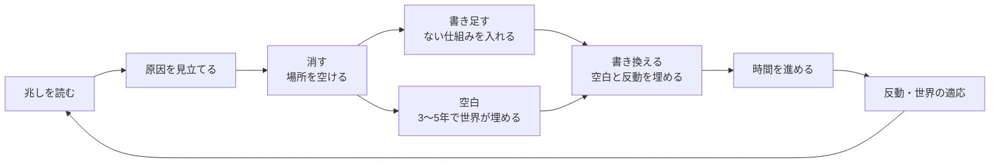

# WORLD.txt 修正・改善案

Sep 25, 2026 · @109mei

**書き換え・書き足し・削除の3つを、兆しを読んで考えて組み合わせないとクリアできないゲームにする。** 難しさは判断から生み、「言葉が通じない」「運」「見えない罰」からは生まない。

## 1. 今の状態（実測）

> この章と6章の数字は、計画を立てた時点（2026-09-25、commit 62c2aa5 のころ）の値。今の値は docs/SPEC.md（2章の数・5章の実測）を見る。今は法則52行・「なぜ？」457・観測記録1239・描く要素191で、消した行は5年ちょうどで世界が埋める。

**今は1種類の操作だけで勝てるステージが多く、3種類をすべて使う作戦は1本もない。** 一方で、書き足しは初見の文の約半分が通じず、通じなくても書換の力が減る。

| 見たこと | 実測 | 何が困るか |
| --- | --- | --- |
| 書き換えだけで勝てる | 食料・感染症・くり返す十年 **100%**、世界大戦 83% | 書き足し・削除を考えなくても解ける |
| 消すだけで勝てる（はじめて遊べる筆の位で、最初の年に3行消す） | 世界大戦 **100%**・気候危機 **90%**・資源枯渇 **90%**・感染症 65% | 「悪いものを消せば勝てる」になっている |
| 2種類だけで勝てる | 最大 **100%**（気候危機：1手＋戦争・動物由来の病・犯罪を消す） | 3種類目を考える理由がない |
| 3種類すべてを使う作戦 | 今の作戦（scripts/strategies.ts）に **0本** | 組み合わせる設計になっていない |
| 決まった年に決まった文を書くだけ（兆しを読まない） | 各ステージの最善で **83〜100%** | 読んで考えなくても勝てる |
| 書き足しが通じるか（初見のつもりの145文） | 読めた 37%・**意味なし 52%**・止まる 10% | 「食料が増える」「病気がなくなる」「気温が下がる」も意味なし |
| 行の書き換えが通じるか（自然な言い換え38文） | 84% | 書き換えは強い |
| 意味のない文を書いたとき | それでも**書換の力を1つ使う** | 3つしかない序盤で致命的 |
| 逆の意味に読まれる文 | 「隕石は大気で燃え尽きる」「小惑星は地球を避ける」→ **隕石が落ちてくる**／「植物は水が少なくても育つ」→ 光なしで育つ | 防ごうとした文が危機を呼ぶ |
| 画面の呼び名をそのまま書く | 20以上が意味なし（「病気がなくなる」「水が尽きなくなる」など） | 知らせで見た言葉が使えない |
| 運の影響 | 同じ一手（数日に一度）で、食料危機は30回中10回クリア。世界を開くたびに種が変わる | 仮説が外れたのか運なのか分からない |
| 世界容量 | 食料危機・世界大戦では最大94%までしか使わず、空きが36字以上残る | 2つのステージで判断を生まない |
| 最初の世界 | 食料危機・見習いの筆で48行中 **34行が封**、書き足しは1行まで | 自由に書き換える体験が狭い |
| 因果の見せ方 | 10年目の大崩れ（作物病原体）に「← 書いた一文」が付かない | いちばんの山場で「そこに影響するのか！」が弱まる |

測り方：ルール本体（src/core）をそのまま回すシミュレーターで、種20〜30個。

## 2. 設計の原則

**クリアに要るのは知識でも運でもなく、「読んで、見立てて、組み立てる力」にする。**

1. **1種類・2種類の操作だけでは勝ちきれない。** 書き換え・書き足し・削除は、ほかの2つでは代わりにならない役割をそれぞれ持つ。
2. **決まった正解がない。** 同じステージでも世界ごとに危機の原因が違い、兆しから見立てないと手が決まらない。
3. **どの手にも必ず反動があり、次の手が要る。** 反動は運ではなく必ず来る。強さは手の強さに比例し、来る時期は兆しで読める。
4. **難しさは判断から生む。** 言葉が通じない・逆に読まれる・運で負ける・見えないところで削られる、は取り除く。
5. **試行錯誤ではなく推理で解く。** 同じ世界でやり直せるようにし、書き直しの総当たりには代償を付ける。

## 3. 3つの操作に役割を持たせる

**消して場所を空け、書き足して新しい仕組みを入れ、書き換えて空白と反動を埋める。この鎖でしか解けないようにする。**

消した行は空白になり、先に自分の文で埋めないと世界が埋めに来る。

### 書き換え：今ある仕組みを変える

- 今：これだけで食料・感染症・くり返す十年が100%になる。
- **言い切りの強さと反動を比例させる。** 「〜ない」「すべて」「消える」は効きも反動も大きい。「ただし」「〜のとき」「少し」で絞った文は、効きも反動も小さい。**言葉の精度が腕前になる。**
- **上書きの傷：** 同じ行を何度も書き直すと、整合性が少しずつ下がる。試し書きの総当たりを抑える。

### 書き足し：48行にない仕組みを持ち込む

- 今：書き足しだけでは、今の作戦の中で最大30%。解に書き足しが要る場面がない。
- **各ステージの解に「48行にない仕組み」を最低1つ必須にする**（蔵・分配・ため池・新しいエネルギー・制度など）。書き換えでは越えられない壁を置く（例：蓄えがないと干ばつの年を越せない）。
- **書き足しは重く、置く場所が要る。** 場所は消して空けるのが基本になる（6章で、世界容量を全ステージで縮める）。
- 短く言い換えて空ける道は残すが、1行につき1度までにする。極小世界の最善の作戦は今、短く言い換えるだけの書き換えを14回していて、判断ではなく作業になっている。

### 削除：場所を空ける（悪いものを消す道具にしない）

- 今：消すだけで世界大戦100%・気候危機90%・資源枯渇90%。消去は完全な打ち消しで、反動は年に0.05〜0.2ずつゆっくり育つ副作用だけで、育ちきる前にクリアできる。しかも字数まで空く。
- **消すと「空白」になる。** 定義のない行は3〜5年のうちに、世界がいちばん起こりやすい形で、赤いインクで埋める（戦争を消す →「争いは別の形で続く」）。先に自分の文で埋めれば防げる。**消すのは時間稼ぎで、解決は書き換え。**
- **消し跡が残る。** 写本の削り跡のように、字数は半分しか戻らない。
- **支えている行ほど、消すと周りが揺らぐ。** 行どうしの依存をデータに持たせる（国家を消す → 貨幣・戦争・教育の行が宙に浮き、整合性が下がる）。

## 4. 考えないと解けない仕組み

**決まった手順を覚えても勝てず、その世界を読んだ人だけが勝てるようにする。**

| 仕組み | 中身 | ねらい |
| --- | --- | --- |
| **原因の型**（最優先） | 同じステージでも、世界ごとに危機の原因が3〜4通りある（食料なら「水が足りない」「届かない」「病害」など）。兆し（ニュース・項目の詳細の「主な原因」）から見立てる。ある型の正解は、別の型では効かない | 覚えた作戦が通じない |
| **世界が適応する** | 同じ解決は10年ほどで効きが落ちる。現実の根拠つき（病原体が別の経路へ移る、害虫の抵抗性、軍拡の再燃、効率が上がると消費が増える逆説） | 途中で読み直して書き直す必要が出る |
| **反動は必ず来る** | 副作用の強さと育つ速さを、手の強さに比例させる（今は、消すだけで勝てるほど反動が軽い）。ステージの出来事も、確率ではなく条件で起こす。育ち始めを兆しとして見せる | 運ではなく、読めば備えられる |
| **危機を重ねる** | 中盤に、最初の解決が悪くする別の危機を置く | 最初の手だけでは終わらない |
| **書換の力を絞る** | はじめ3→2、回復は5年ごと→7年ごと（5章の修正のあとに入れる） | 無駄打ちできない |
| インクが褪せる（任意） | 書き換えた行は、年とともに元の文へ戻っていく。重い書き換えほど早い | 塗り直すか、新しい手に使うかで悩む |

**原因の型は、最初の3年のうちに見分けられる兆しを必ず2つ以上出す。** 見分けられない型は、ただの運になる。

## 5. 先に直す修正（公平さの土台）

**難しくする前に、言葉が通じないせいで負ける道をなくす。** ここを残したまま難しくすると、難しさの正体が「読み取りの穴」になる。

1. **意味のない文では書換の力を使わない。** `write()` が力を使う前に止める。入力中に「世界に届かない言葉」とだけ出す（結果の予測ではないので、方針には反しない）。
2. **逆の読み取りを直す。** 1章の3例を回帰テスト（`tests/wild.test.ts`）に入れる。
3. **画面の呼び名は、そのまま書けばその意味に読まれる**ことをテストで保証する（概念の名前と読み取りの名前。「誰にも確かめられない」ものは除く）。
4. **助詞のゆれをそろえる。** 「病気は消える」は読めるのに、「病気が消える」は意味なしになる。
5. **結果を願う文**（〜が増える・〜が減る・〜は起きない・〜は減らない）は「願い」として読み、重さと反動を大きくする。「手はあるが高くつく」にする。読まない場合も、意味なしの理由に「世界は結果ではなく決まりを読む」と、関係する行番号を添える。
6. **大きく崩れた年にも「← 書いた一文」を付ける。** ステージの出来事でも、打撃を強めた要因が書き換えから来ていれば原因として示す（作物病原体 ← 農業の縮小 ←「人間は二日に一度食べる」）。
7. **同じ世界でもう一度**（同じ種）と、世界番号での共有。運で負けたのか、判断で負けたのかを見分けられるようにする。
8. **静かな年は短くし、まとめて飛ばさない。** 何も起きない年は、計算の演出を約0.4秒にして、結果の画面を出さずに世界へ戻る。「何か起きるまで進める」ボタンは置かない（兆しを1年ずつ読むのが遊びの芯なので。分析の12章）。
9. **見た目の細部。** 「つながり」のアイコンに名前を付ける／薄い文字（`--faint`、今3.9:1）を4.5:1以上にする／字数を「7字＋重さ25」のように分けて出す。

## 6. テーマの軸を「何を世界に残すか」へ

**舞台（現実の地球と人類文明）は変えず、企画書のもともとの前提「世界を維持できる情報量が減っている」を、全ステージの芯にする。**

- **全ステージで世界容量が縮む。** 毎回「何を手放すか」の判断が要る。食料危機・世界大戦で容量が飾りになっている問題も解ける。
- **悪い行を全部消しても、約60字しか空かない**（戦争・兵器・犯罪・動物由来の病・空気感染の5行で合わせて59字。消し跡を入れるとその半分）。足りないので、**大切なものを手放す判断**に追い込む。
- **「なくてもすぐは困らないが、長く効く」行を足す。** 季節・睡眠・芸術・宗教・家族・遊び（企画書48章）。消すと、幸福・創造・教育・安定が何年もかけて落ちる。
- 消すことは「武器」から「喪失」に変わる。3章の「空白」「消し跡」とつながる。
- キャッチコピー：**「あなたなら、何を世界に残しますか？」**（企画書にある文）。
- 舞台ごと変える案は取らない。「なぜ？」366件・観測記録1076件・情景の要素190を作り直すことになり、今の問題の多くはテーマのせいではない。黒と銀の写本の見た目も強みなのでそのままにする。

## 7. 目標の数字（手触りの目安の改訂）

**考えた3種類の組み合わせだけが勝てる数字にする。** `tests/feel.test.ts` に足し、`npm run sim` で測る。目標の値は案で、測りながら詰める。

> 今の目安と実測は docs/SPEC.md の5章が正。テストで確かめているのは、型を外した欄20%以下と見立てるボット50%以上（`tests/feel.test.ts`）。操作を絞った作戦と決まった手順の目標は `npx tsx scripts/bots.ts all 30` で測るだけで、書き換えだけ・書き足しだけ・2種類だけ・決まった手順の最善は、まだ目標に届いていない（どう直すかは作り手が決める）。

| 作戦 | 今（実測） | 目標 |
| --- | --- | --- |
| 何もしない・でたらめ | 0% | 0% |
| 書き換えだけ | 最大 100% | **5%以下** |
| 書き足しだけ | 最大 30%（今の作戦の中で） | **0%** |
| 消すだけ | 最大 100% | **0%** |
| 2種類だけ | 最大 100% | **15%以下** |
| 決まった年に決まった文を書くだけ（兆しを読まない） | 最善 83〜100% | **15%以下** |
| 3種類を組み合わせ、原因の型を見立てて途中で直す | （その作戦がまだない） | **最善で60〜70%、考えた手で30〜40%** |
| 原因の型を外した作戦 | （型がまだない） | **10%以下** |

足すボットとテスト：

- **操作を絞ったボット**：書き換えだけ・書き足しだけ・消すだけ・2種類だけ。今の作戦と言い回し集から総当たりで組み、上限を確かめる（今回の測定では、消すだけの3行の組み合わせを総当たりした）。
- **決まった手順のボット**：兆しを読まず、決まった年に書く。
- **見立てるボット**：最初の3年の兆しから原因の型を当て、型ごとの作戦を選び、適応や反動を読んで書き直す（目標の上の段）。
- **型と作戦の表**：どの型にどの作戦が効くかを出し、型を外すと勝てないことを確かめる。
- `npm run ranks` も更新し、どのステージもはじめて遊べる筆の位で3種類の作戦が書けることを確かめる。

## 8. 進め方

**公平さの土台（乱数をなくす）→ 削除 → 3つの役割 → 考える仕組み → テーマの軸 → 読み分け → 人々の心 → 社会の学問と兆し → 画面と演出 → 開いていく順番の順に進める。** 各段階のあとに `npm test`・`npm run e2e`・`npm run sim`・`npm run ranks` を通す（CLAUDE.md の決まり）。段階ごとのプロンプトは「Claude Code 用プロンプト」のタブにある。

| 段階 | 中身 | 確かめ方 |
| --- | --- | --- |
| 1 公平さの土台 | 5章の1〜8と、遊んでいる間の乱数をなくす（分析の7章、P17） | 回帰テスト・呼び名のテスト・`npm run fuzz` で怪しい読み取り0。core に乱数の呼び出しが0 |
| 2 削除を変える | 空白・消し跡・支えている行（3章） | 消すだけ 0% |
| 3 3つの役割 | 言い切りと反動の比例・上書きの傷・書き足しが要る壁（3章） | 書き換えだけ 5%以下、2種類だけ 15%以下 |
| 4 考える仕組み | 原因の型・世界の適応・必ず来る反動・危機の重ね・書換の力（4章） | 決まった手順 15%以下、見立てるボットが目標の上の段 |
| 5 テーマの軸 | 全ステージで容量が縮む・手放す行を足す（6章） | どのステージでも最善の作戦が容量を使い切る |
| 6 読み分け | 性質・制度・条件つき（分析の5章、P10） | 3つの読まれ方それぞれに勝ち筋がある。国家を消した世界では制度の文が効かない |
| 7 人々の心 | 慣れ・損の重さ・信頼・先行きの不安・考え方の広がり（分析の7章、P15） | 1年での悪化は10年かけた悪化より大きく揺れる。書く順番で結果が変わる |
| 8 社会の学問と兆し | 遅れと行きすぎ、戻りの遅さ、感染の波、限りを超えた崩れ、戦争を条件で起こす（分析の7章、P12・P16） | どの崩れにも、前の年までに兆しが出ている。乱数で始まる出来事が0 |
| 9 画面と演出 | 画面の言葉・情景・現実では・演出・見やすさ・明るい画面（PixiJS を含む。分析の2・6・11・12章、P8・P11・P13・P14・P19・P20・P21） | 常用漢字の外の字が画面に0。名前なしの絵で施設を10個中8個以上言い当てられる。何もない間に動くものが0、絵文字と字の記号が0。明るい画面でも文字の比がすべて4.5:1以上 |
| 10 開いていく順番 | ステージ・書ける範囲・世界の決まり・画面を1回に1つずつ開く（分析の13章、P18）。実績とやりこみ（3つの印・世界番号の挑戦・図鑑・改稿者の試練。分析の17章、P22） | どのステージでも新しく覚えることは1つ。紹介前の決まりが負けの主な原因になる割合0%。作り手の解が、どの世界番号でも印の手数以内で通る |
| 11 仕上げ | 5章の9・あそびかたの書き直し・SPEC 5章の目安と実測の更新。セーブと棋譜（ホーム画面への追加の案内・ファイルでの書き出し・再生。分析の18章、P23） | `npm run screens` で崩れがない。棋譜から作り直した世界が、保存した世界と一致する。古い版のセーブが読める |

段階3の「書き足しの場所を消して空ける」は段階5の容量の縮みで完成するので、段階3の目標は段階5のあとでもう一度測る。

## 9. 決めたこと（2026-09-25）

**すべて、おすすめどおりに決めた。** そのうえで、WebGL（PixiJS）は無料なので**使う**、学問の仕組みは**すべて入れる**、遊んでいる間の**乱数は使わない**（ラプラスの悪魔のため）、**開いていく順番を作り込む**、の4つを決めた。分析のタブの分もここに1つにまとめてある。

**ゲームの仕組み**

- [x] **最初の食料危機も超難しくするか。** 決定：「難しいが学べる」段にとどめ、見立てと3種類の組み合わせを学ぶ場にする
- [x] **テーマの軸を「何を世界に残すか」に寄せるか（6章）。** 決定：寄せる。寄せないと、書き足しのために場所を空ける必然が弱くなる
- [x] **結果を願う文を「願い」として重く読むか（5章の5）。** 決定：重く読む。「手はあるが高くつく」にすると、書き方の精度が腕前になる
- [x] **書き方の読み分け（性質・制度・条件つき）を入れるか（分析の5章）。** 決定：入れる。国家の行との組み合わせと、書く順番の判断が生まれる
- [x] **学問の仕組みをどれから入れるか（分析の7章）。** 決定：**すべて入れる**。物理・工学、心理学、社会の学問の全部。開いていく順番（分析の13章）に合わせ、1ステージに1つの考えずつ紹介する。紹介する前は弱く動き、負けの主な原因にはしない
- [x] **戦争の始まりを、確率から条件に変えるか（分析の7章）。** 決定：変える。運ではなく兆しで読める、という2章の原則と合う
- [x] **インクが褪せる（4章）を入れるか。** 決定：今は入れない。読み分けと人々の心で判断が増えるので、それを測ってから決める
- [x] **遊んでいる間の乱数をなくすか（分析の7章）。** 決定：なくす。出来事の確率・戦争の始まり・世界異常・危機の選び方をすべて決まった式にする。同じ世界番号と同じ書き換えなら、誰が遊んでも同じ世界になる
- [x] **開いていく順番を作り込むか（分析の13章）。** 決定：作り込む。ステージ・書ける範囲・世界の決まり・画面を、1回に1つずつ、体験してから開く
- [x] **実績とやりこみをどうするか（分析の17章）。** 決定：同じ世界を少ない手で解く腕前と、結末や決まりを見つける発見の2本にする。世界ごとの3つの印・世界番号の挑戦・図鑑・改稿者の試練を足し、実績は4種類に分けて見直す。連続ログイン・期間限定・くじは入れない

**画面と言葉**

- [x] **題を『ラプラスの庭』にするか（分析の1章）。** 決定：する。英字のロゴは WORLD.txt を残す
- [x] **操作とタブを普通の言葉にするか（分析の2章）。** 決定：する。試作の10画面はこの案で直してある
- [x] **「現実では」を、ノートで出典つきの一覧にするか（分析の6章）。** 決定：する。画面では短く、ノートで全文
- [x] **書く前に「触れる柱」だけ光らせるか（分析の10章）。** 決定：光らせない。結果の予測を見せない方針を守り、代わりに読まれ方を出す
- [x] **ボタン「何か起きるまで」を置くか（分析の12章）。** 決定：置かない。1年ずつ進め、静かな年は計算を短くして結果の画面を出さない
- [x] **いつ動かすか（分析の11・12章）。** 決定：何か起きたときだけ。ずっと続く動きはやめ、新しく出たものを光らせるのは3回まで
- [x] **絵を止めずに動かし続けるか（2026年9月、作り手の指示）。** 決定：動かし続ける。世界の情景とタイトルの絵は途中で止まらずゆっくり動く（画面の外と「動きを減らす」では止める）。文字やカードが動くのは、これまでどおり何か起きたときだけ
- [x] **句読点をどこまで使うか（2026年9月、作り手の指示）。** 決定：ないと読みにくい所だけ。1つの文だけの表示には「。」を付けず、「、」は読み違える所・長い文の区切り・並べる所だけ。タイトルは句読点の代わりに行を分ける（docs/TERMS.md「句読点」）
- [x] **記号と絵文字をどうするか（分析の12章）。** 決定：絵文字と字の記号は使わない。同じ線の太さのアイコンに、必ず言葉を添える
- [x] **数と状態をどう出すか（分析の12章）。** 決定：一目で追うのは寿命と4つの柱。状態は言葉と棒と5段の色で出し、数字は年・回数・人数・字数・進み具合だけ。図は同じ物差しの上の位置で比べる
- [x] **明るい画面を用意するか（分析の12章）。** 決定：用意する。最初は端末の設定に合わせ、メニューで自動・明るい・暗いを選べる。色の役割は同じで、白い地で読める濃さ（4.5:1以上）にする。情景は昼の絵にする

**作り方**

- [x] **粒子とゆがみに WebGL（PixiJS）を使うか（分析の11章）。** 決定：**使う**（無料。MIT ライセンス）。演出が要るときだけ後から読み込み、今の読み込みの決まり（CSP）も守る。※まだ入れていない（パッケージの取り込みの許可待ち。今の演出は SVG と CSS と Web Animations API。CLAUDE.md の構成）
- [x] **序章「ひと区画の庭」を作るか（分析の13章）。** 決定：作る。3つの操作と空白を、説明なしで最初の5分に覚えられる
- [x] **セーブをどうするか（分析の18章）。** 決定：今のしくみに、ホーム画面への追加の案内・ファイルでの書き出し・棋譜（世界番号と書いた文の記録）を足す。クラウドのセーブは作らない

テーマとゲーム性の分析、題「ラプラスの庭」の検討、画面設計：docs/ANALYSIS.md

実装と検証に使う Claude Code 用のプロンプト：docs/PROMPTS.md
